<div align="center">
  
  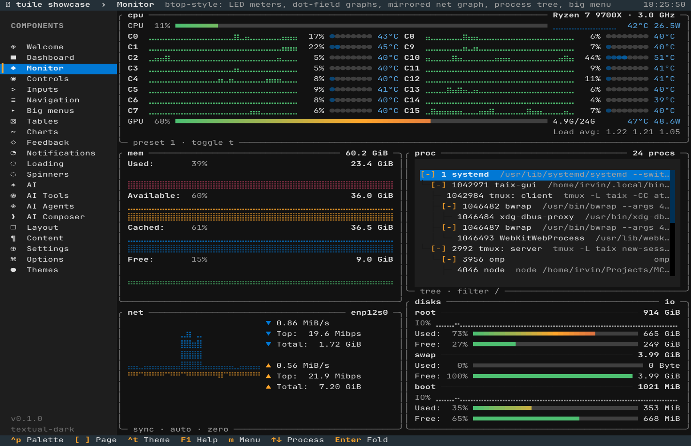
  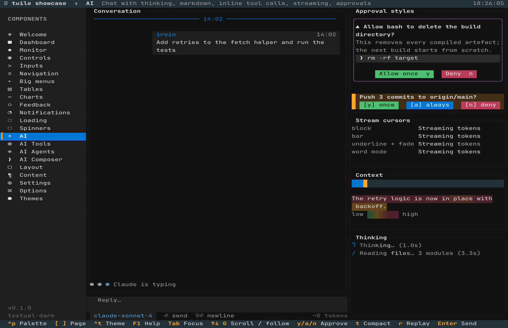
</div>

<div align="center">
  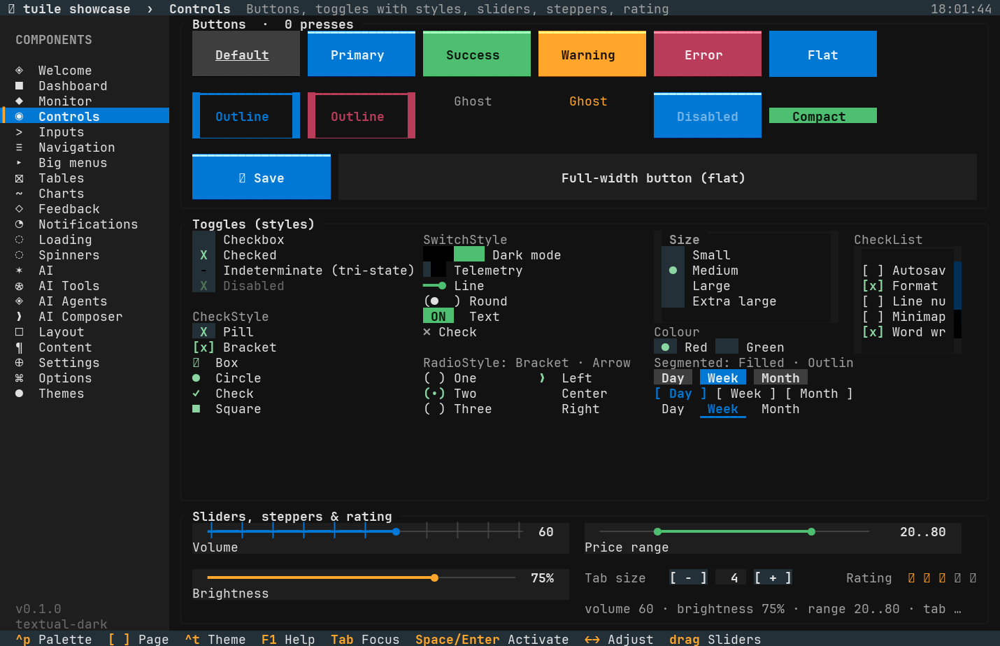
  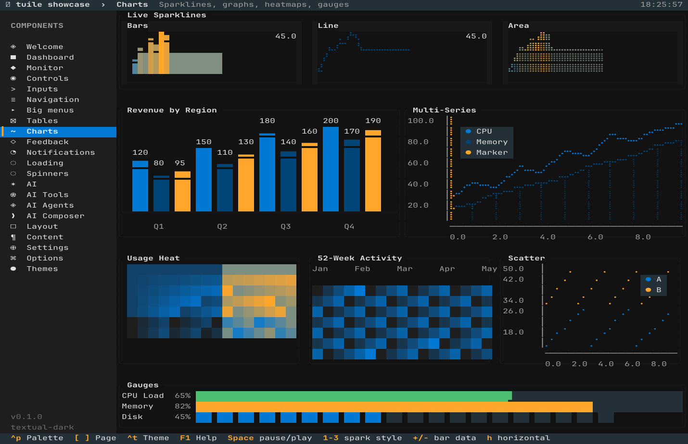
  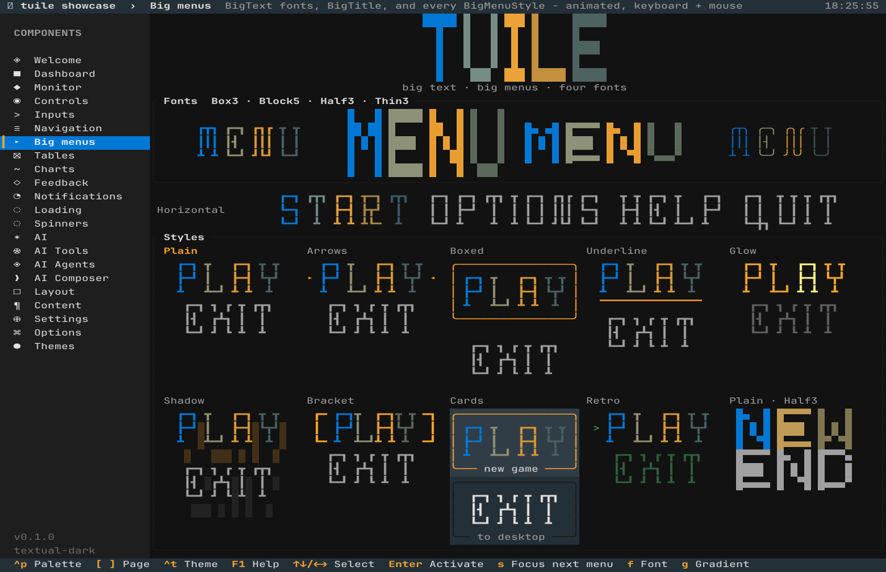
</div>

<h1 align="center">tuile</h1>

<h6 align="center">
    <a href="https://osyna.github.io/tuile/"><b>Documentation</b></a>
    ·
    <a href="#-widget-catalogue">Catalogue</a>
    ·
    <a href="#-showcase">Showcase</a>
    ·
    <a href="https://osyna.github.io/tuile/reference/widget-contract.html">Widget contract</a>
    ·
    <a href="https://osyna.github.io/tuile/reference/faq.html">FAQ</a>
</h6>

<div align="center">
  <a href="https://github.com/Osyna/tuile/actions/workflows/ci.yml"></a>
  <a href="https://github.com/Osyna/tuile/actions/workflows/docs.yml"></a>
  
  
  
  
</div>

<br/>

**Textual-grade components for [ratatui](https://ratatui.rs).** tuile is a widget library and
design system for animated, mouse-aware terminal UIs in Rust: 108 widget types, a colour
system that expands ten colours into thirty semantic roles, tweened animation, overlays, and
a 22-page `showcase` app that exercises every one of them. It ports the parts of
[Textual](https://textual.textualize.io) that make building a TUI pleasant into plain ratatui
code, with no runtime, no CSS engine, and two extra dependencies.

*tuile* (tweel) is French for tile, and the thin curved wafer you drape over a mould while it
is still warm. Both fit: the library tiles a terminal, and it is shaped over ratatui.

## 🚀 Features

- **108 widgets across 15 families**: controls, text entry, navigation, tables, nine chart
  types, feedback, notifications, loaders, layout, menus, content, and a full AI chat harness
- **Focus, hover and mouse hit-testing built in.** Every state caches the rects it drew, so
  clicks resolve without recomputing layout
- **12 built-in palettes** (`textual-dark`, `nord`, `gruvbox`, `catppuccin-mocha`, `dracula`,
  `tokyo-night`, `monokai`, `flexoki`, `rose-pine`…) plus your own from a single accent colour
- **Animation that costs nothing when idle**: tweens, easings, pulses and blinks over a shared
  epoch; the runtime redraws at 60 fps only while something is moving
- **102 spinners**: the 90 from [cli-spinners](https://github.com/sindresorhus/cli-spinners)
  and yaspin, 12 originals, and your own from a `&[&str]`
- **Overlays that land on top**: dropdowns, menus, tooltips, modals, command palette, toasts
- **Eight chrome shapes per text field**, from Textual's tall border to a padded `›` band,
  with side bars in four thicknesses
- **Zero `unsafe`** (compiler-enforced), no panics at any terminal size, 260 tests

## ⚡ Install

As a library:

```toml
[dependencies]
tuile = "0.1"                                        # re-exports ratatui + crossterm
```

Before the first crates.io release lands, or to track main:

```toml
tuile = { git = "https://github.com/Osyna/tuile" }
```

To run the gallery without cloning, download a build for your platform from the
[latest release](https://github.com/Osyna/tuile/releases/latest), or build it yourself:

```
cargo install --git https://github.com/Osyna/tuile showcase
```

## ⚡ Quick start

```rust
use tuile::prelude::*;

struct Demo { dark: SwitchState, name: InputState, focus: Focus<Id> }
#[derive(Clone, Copy, PartialEq)] enum Id { Dark, Name }

impl App for Demo {
    fn draw(&mut self, frame: &mut Frame, now: Instant) {
        let [a, b] = Layout::vertical([Constraint::Length(3); 2]).areas(center(frame.area(), 40, 7));
        let buf = frame.buffer_mut();
        // 1. a builder configures one frame …
        Switch::new().label("Dark mode").focused(self.focus.is(Id::Dark)).now(now)
            .render(a, buf, &mut self.dark);        // 2. … into a State that lives between frames
        Input::new().placeholder("Your name").focused(self.focus.is(Id::Name)).now(now)
            .render(b, buf, &mut self.name);
    }

    fn event(&mut self, ev: Event, _now: Instant) -> Flow {
        if let Event::Key(k) = &ev {
            if ctrl(k, 'c') { return Flow::Quit; }
            if self.focus.handle_key(*k).is_consumed() { return Flow::Continue; }   // Tab / ⇧Tab
        }
        // 3. events go to states and come back as an Outcome
        let out = match self.focus.current() {
            Some(Id::Dark) => self.dark.handle(&ev),
            Some(Id::Name) => self.name.handle(&ev),
            None => Outcome::Ignored,
        };
        if out.is_changed() { /* the value changed: react */ }
        Flow::Continue
    }

    fn animating(&self, now: Instant) -> bool { self.dark.animating(now) }
}

fn main() -> std::io::Result<()> {
    theme::set_by_name("nord");
    run(&mut Demo {
        dark: SwitchState::new(true),
        name: InputState::new(),
        focus: Focus::new([Id::Dark, Id::Name]),
    })
}
```

Then run the gallery to see everything else:

```
cargo run --release -p showcase
cargo run --release -p showcase -- --page charts --theme nord
```

## 🧠 The model: three things to learn

| | |
|---|---|
| **Builder + State** | `Widget::new().option(..).render(area, buf, &mut state)`. Builders are cheap per-frame values. States own the value, hover and press tracking, tweens and scroll offsets. |
| **`Interactive` → `Outcome`** | `state.handle(&event)` returns `Ignored`, `Consumed` (redraw) or `Changed` (the value moved). Mouse hit-testing uses the rects cached during `render`, so layout is never computed twice. |
| **`App` + `run`** | The runtime sets up the terminal with mouse capture and panic-safe restore, and redraws at 60 fps only while `animating()` is true. |

Focus belongs to your app through `Focus<Id>`; hover belongs to each state's `HitBox`. Overlays
render last through `render_overlay(..)` or a dedicated stack widget.

`use tuile::prelude::*;` brings in every widget, the theme, layout and draw helpers, and the
ratatui types you need (`Rect`, `Buffer`, `Frame`, key and mouse events). `tuile::ratatui` and
`tuile::crossterm` are re-exported, so your app does not pin its own versions.

## 🎨 Theming

`theme.rs` is a port of Textual's `ColorSystem`. A palette of about ten colours expands into
thirty semantic roles (`text`, `text-muted`, `panel`, `boost`, `border`, `cursor`, `hover`,
`selection`, `scrollbar`, `footer-key`…) using CIE-Lab lightness steps and contrast-aware
`auto N%` text.

```rust
theme::set_by_name("catppuccin-mocha");                                   // every widget, at once
let mine = Theme::resolve(&ThemeSpec::new("mine", true, Rgb::hex(0x7c3aed)), None);
Button::new("Save").theme(&mine).render(area, buf, &mut state);           // or just this one
```

Twelve palettes ship: `textual-dark`, `textual-light`, `nord`, `gruvbox`, `catppuccin-mocha`,
`catppuccin-latte`, `dracula`, `tokyo-night`, `monokai`, `flexoki`, `solarized-light`,
`rose-pine`.

## 🧩 Widget catalogue

<details>
<summary><b>108 widget types across 42 modules. Click to expand.</b></summary>

<br/>

| Family | Widgets |
|---|---|
| Controls | `Button` (3D / flat / outline / ghost, compact, icon), `Checkbox` + `CheckList` (tri-state; `CheckStyle`: pill / `[x]` / `☑` / `●` / `✓` / `■`), `Switch` (animated; `SwitchStyle`: pill / slim / line / round / `ON`·`OFF` / `✓`·`✗`), `RadioGroup` (`RadioStyle`: dot / `(•)` / `✓` / `❯`), `Segmented` (filled / outline / underline / text), `Slider` + `RangeSlider`, `Stepper`, `Rating` |
| Text entry | `Input` (selection, validation, restrict, suggester, password, prefix/suffix), `TextArea` (line numbers, undo/redo, highlighter hook, `CursorStyle` block / bar / underline / outline, blink, `Ln, Col`, click-to-position, wheel), `Select`, `Combobox` (fuzzy), `MultiSelect` (`DropdownWidth::Auto / Field / Fixed`), all with `.shape(FieldShape)`: Textual `Tall`, thin side `Bars`/`Bar` of any `Edge` thickness, `Rule`, `Round`, `Prompt`, `Band`, `None` |
| Navigation | `TabBar` (underline / boxed / pills / segmented / minimal, closable, animated), `TabbedContent`, `ListView` (filter, multi-select, details), `TreeView` (guides, expand/collapse), `MenuBar` + `ContextMenu` (submenus, shortcuts), `Breadcrumbs`, `Paginator` |
| Data | `DataTable` (sortable, zebra, row/cell cursor, multi-select, column resize, filter), `KeyValueList`, `Digits` (Textual big numerals) |
| Charts | `SparkChart` (bars, braille line/area, btop dot `Field`, `mirrored`), `BarGraph` (grouped, horizontal), `LineGraph` (braille, area, grid, legend), `ScatterPlot`, `Heatmap`, `ActivityGraph`, `Meter` (line / block / segments / LED / dots, gradient, suffix), `RadialGauge`, `BrailleCanvas` |
| Feedback | `ProgressBar` (tweened, ETA, indeterminate), `StepProgress`, `Spinner` + `spinners::*`, `LoadingIndicator`, `Marquee`, `Blinker`, `Callout` (`LeftBar` / `Bar(Edge)` / `Round`), `Modal` (confirm / alert / prompt), `CommandPalette` (fuzzy), `Tooltip` |
| Notifications | `Toaster` / `ToastStack` × 10 styles (`Card`, `Flat`, `Minimal`, `Pill`, `Outline`, `Banner`, `Glass`, `Progress` with a live value, `Action` with inline buttons, `Grouped` `+N more`), 6 positions, slide / fade / pop, pause-on-hover; `NotificationCenter` (grouped inbox, unread dots, filter, scroll), `Banner`, `InlineAlert`, `count_badge` |
| Loading | `Loader` × 20 styles, bars: `Scanner`, `Comet`, `Sweep`, `FillDrain`, `Pulse`, `Stripes`, `Rainbow`, `Snake`, `Chase`, `Blocks`, `Wave`, `Bounce`, `Ping`, `Heartbeat`; text: `Ellipsis`, `Shimmer`, `Typewriter`; scenes: `Equalizer`, `Rain`, `Radar`; `Skeleton` (text / card / avatar / list / table / chart with a diagonal sweep); `LoadingOverlay` |
| AI chat | `ChatView` (bubbles, timestamps, hover, compact, `▾ N new` pill) over `ChatMessage`s of `ChatBlock`s: `Text` (inline markdown), `Code` (language chip), `Thinking` (collapsible, shimmer while streaming), `ToolCall` (status glyph, duration), `Divider`; `begin_stream` / `stream_tick` reveal text at N cps; `TypingIndicator`, `StreamText`, `Approval` (card / inline / banner, `.command` preview, `.danger`), `ContextGauge`, `TokenHeat`, `DiffStat` |
| AI tools | `ToolTimeline` (nested steps, live elapsed, expandable output), `ShellBlock` (streaming stdout/stderr, exit pill), `CodeBlock` (gutter, highlighter hook, caret), `EditPreview` (animated diff reveal, side-by-side, accept / reject), `ChangeSet` (A/M/D/R badges, +/− bars), `JsonTree` + `Json::parse`, `RetryNotice` |
| AI agents | `AgentTree` (status glyphs, model chips, tokens · elapsed), `AgentLanes` (gantt with live marker, auto-scroll), `TokenMeter` (stacked input / output / cache), `CostMeter` (spend vs budget, rate, time left), `ContextMap`, `CompactionBanner`, `TurnStats`, `RateGraph`, `SessionList`, `ModelPicker`, `ElapsedTimer` |
| AI composer | `SlashMenu` + `MentionPicker` (anchored popups, fuzzy ranking with highlighted matches), `AttachmentChips`, `ModeBadge` (Plan / Act / Ask / Auto), `HarnessStatus` (drops segments by priority), `QuestionCard`, `PlanView`, `MessageQueue`, `Suggestions` |
| Layout & chrome | `SplitPane` (draggable), `ScrollView` (offscreen buffer, smooth), `Scrollbar`, `Panel` (title, right title, footer keys, badge), `Collapsible` + `Accordion`, `AppHeader`, `KeyFooter`, `StatusLine`, `Placeholder` |
| Menus & settings | `OptionList` (grouped rows, in-place bool/choice/int cycling), `BigText` × 4 fonts + `BigTitle`, `BigMenu` × 10 styles, `CommandPalette`, `MenuBar` |
| Content | `Label`, `Rule`, `Badge`, `Pill`, `KeyCap`, `Link`, `StatCard`, `Markup` (Rich-style `[b]…[/b]`), `Markdown`, `LogView`, `Calendar` + `DatePicker`, `Swatches`, `ColorPicker`, `GradientBar`, `ThemePalette`, `Steps`, `Timeline` |

Foundation modules: `core` (Outcome, Look, Focus, HitBox, key helpers), `draw` (clipped text,
16 border styles with titles, eighth-block bars, blending, wrapping), `layout` (centring,
grids, flow, popup placement, overlay queue), `anim` (tweens, easings, pulses, blinks, shared
epoch), `fuzzy`, `runtime` (app loop, local clock, civil dates).

</details>

## 📸 Showcase

`showcase/` is a 22-page gallery. Keys: `]` `[` pages, `alt+1..9` jump, `^p` palette, `^t`
theme, `^b` sidebar, `F1` help, `F3` reduce motion, `Tab` focus, mouse everywhere.

| **Dashboard** | **Controls** |
|---|---|
|  |  |
| **Inputs** | **Charts** |
| 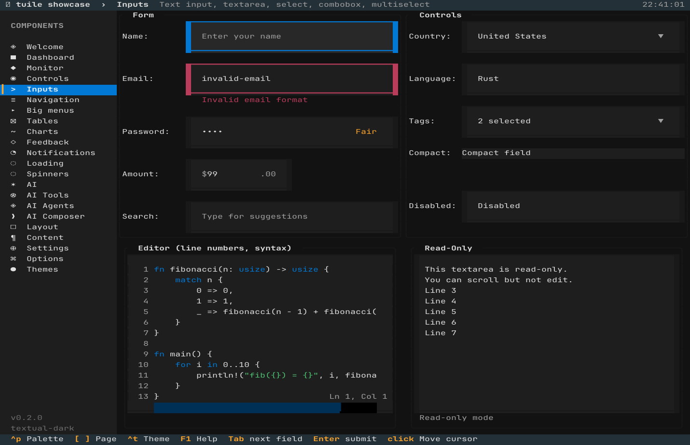 |  |
| **AI** (a replayed harness turn) | **Monitor** (btop-style) |
|  |  |

<details>
<summary><b>The other sixteen pages.</b></summary>

<br/>

| **Feedback** (toasts, nord) | **Settings** |
|---|---|
|  | 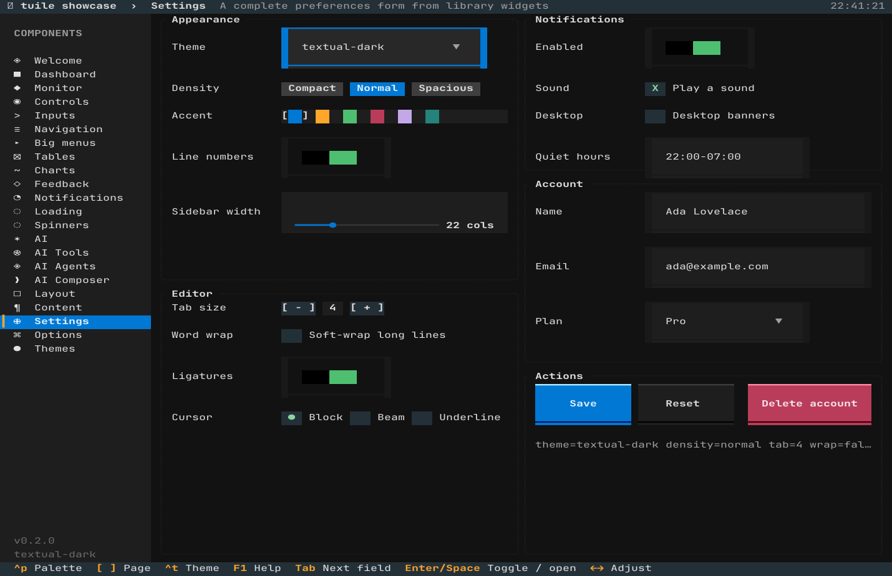 |
| **Navigation** | **Tables** |
| 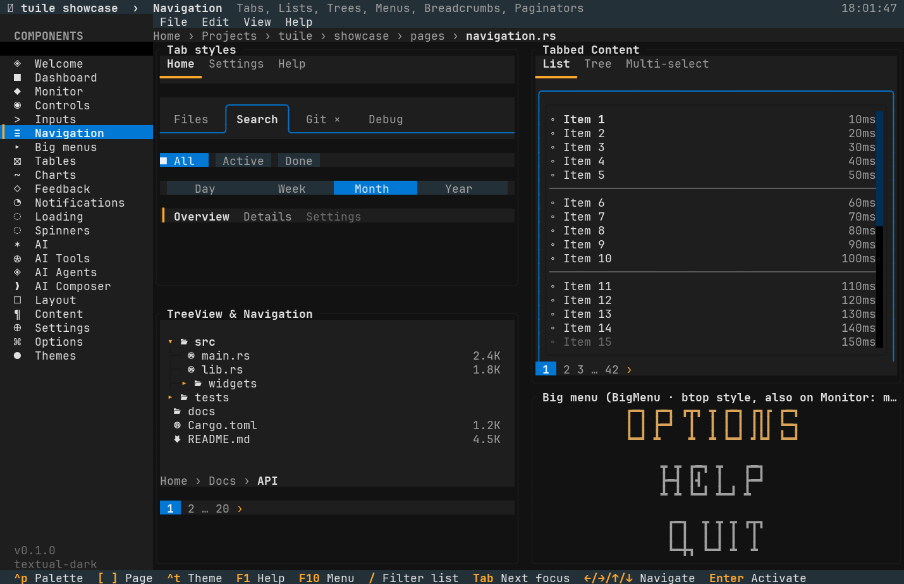 | 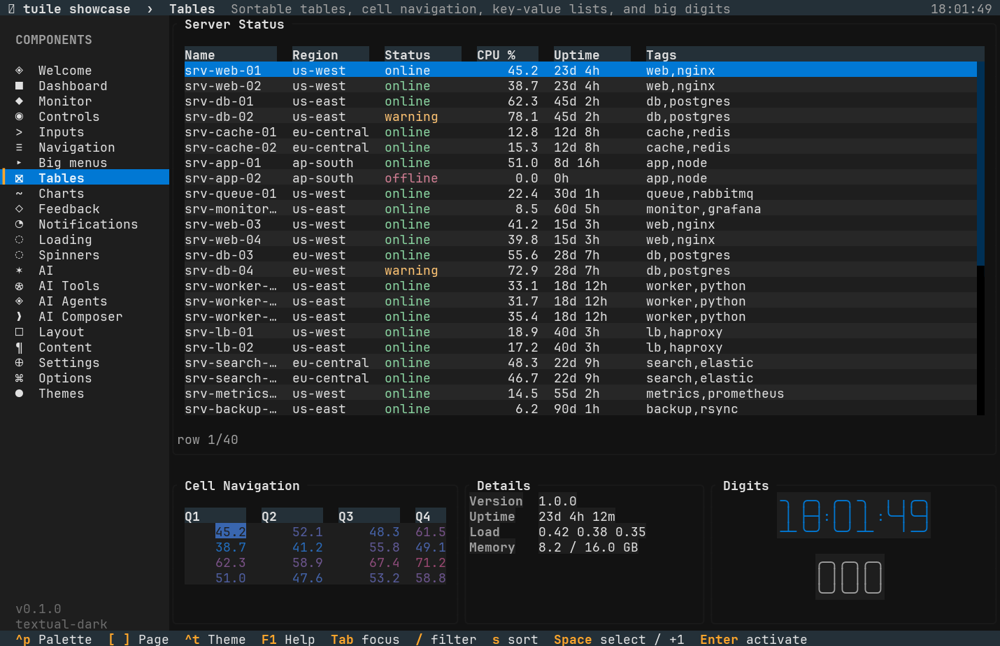 |
| **Layout** | **Content** |
| 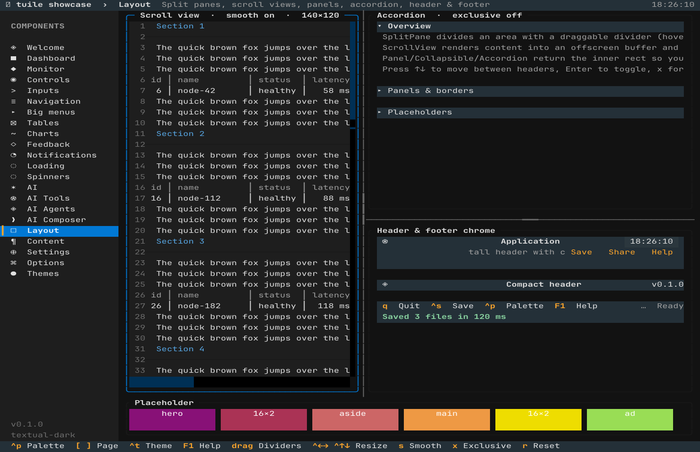 | 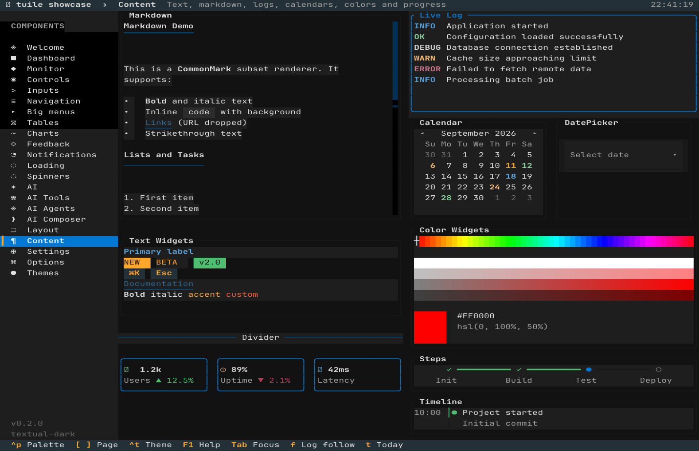 |
| **Themes** | **Command palette** (nord) |
| 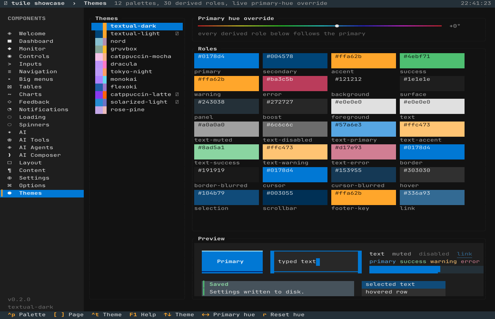 | 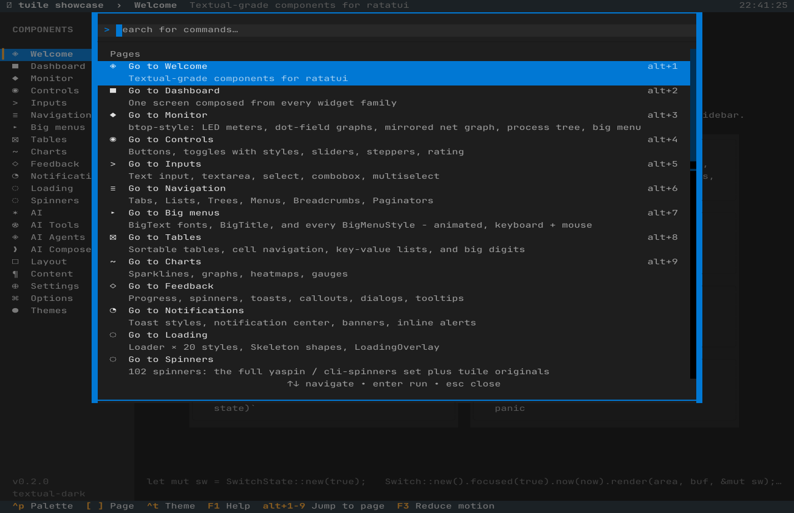 |
| **Spinners** (102-entry catalog) | **Loading** (20 styles, skeletons, overlay) |
| 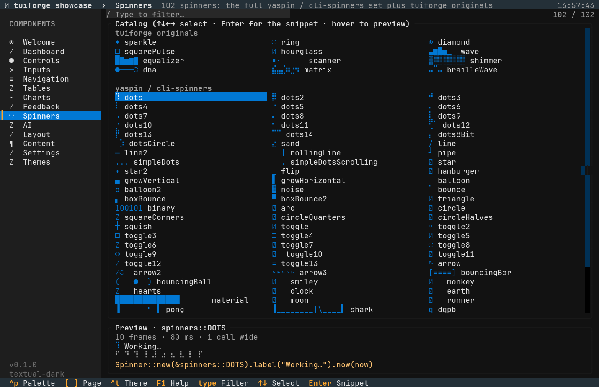 | 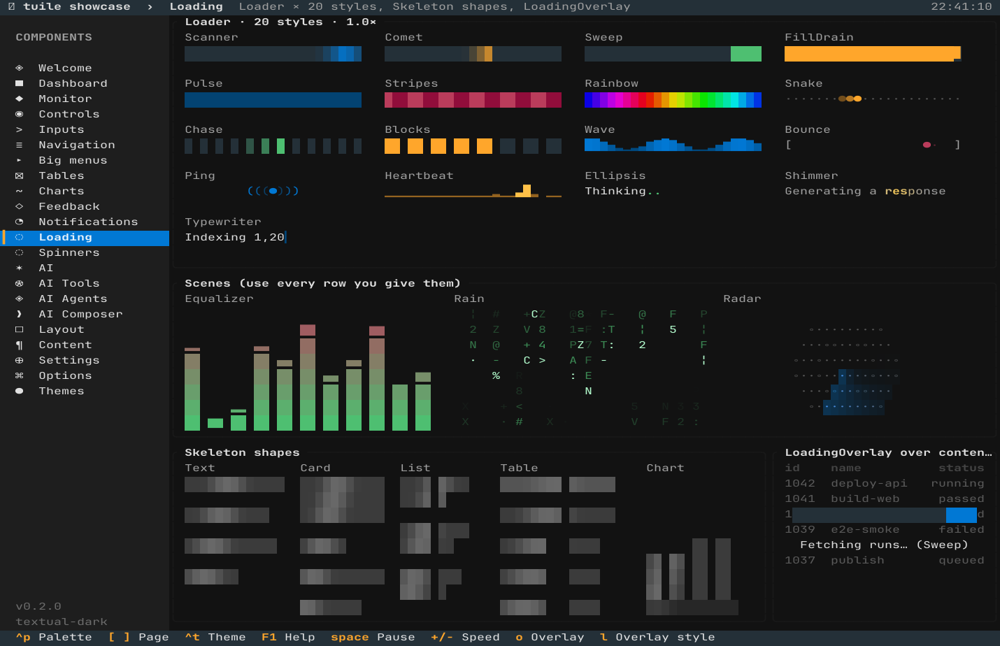 |
| **Big menus** (4 fonts, 10 styles) | **Notifications** |
|  |  |
| **Options** (omp-style settings) | **Welcome** |
| 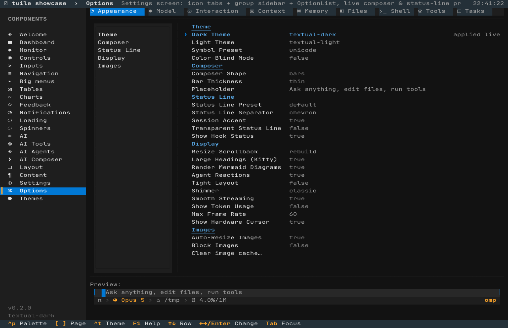 | 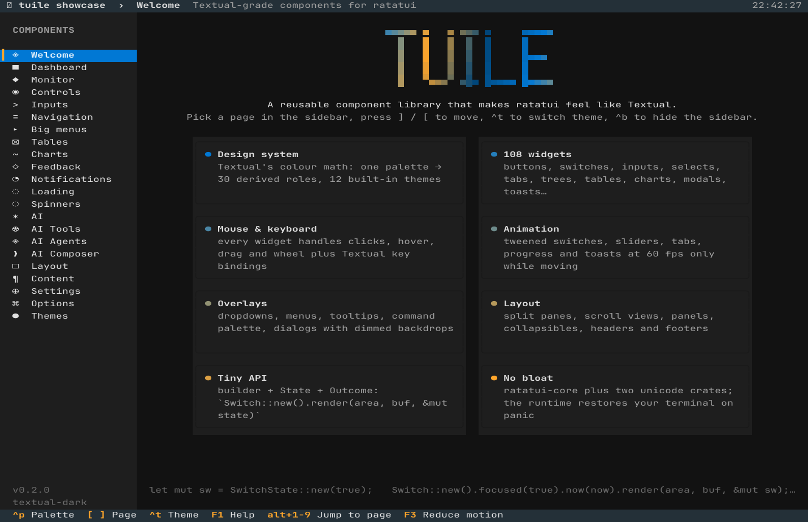 |
| **AI Tools** | **AI Agents** |
| 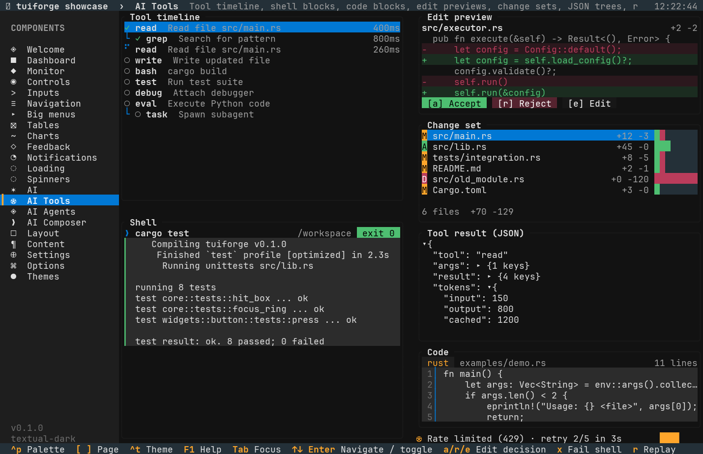 | 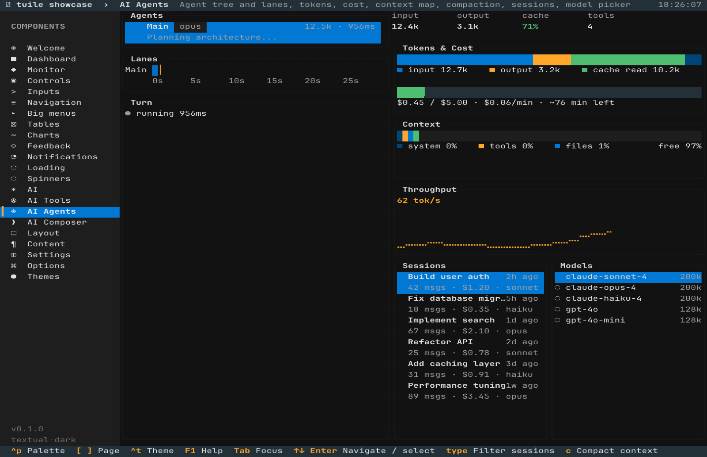 |
| **AI Composer** | |
| 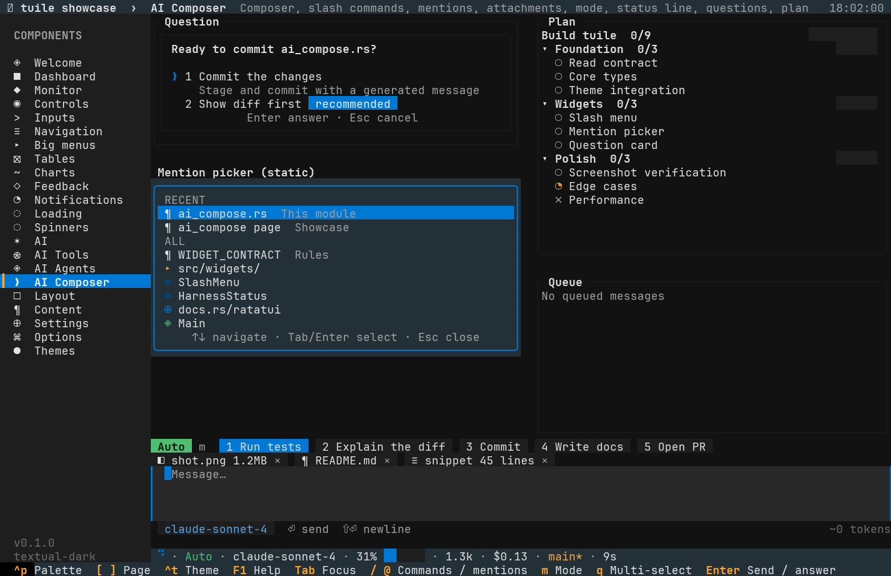 | |

</details>

Screenshots are captured headlessly for review and CI:

```
cargo xtask shot -s 130x42 -k "Tab Enter" -o out.png -- ./target/release/showcase --page inputs
```

## ⚙️ What you get over plain ratatui

| | Plain ratatui | tuile |
|---|---|---|
| Focus | Track the focused widget yourself, wire Tab and Shift-Tab | `Focus<Id>`, wrapping and reorderable |
| Mouse | Compare event coordinates against layout you recompute | Each state caches its rects; `handle_mouse` resolves hover, press and drag |
| Colour | Pick every colour by hand, per widget | Ten colours expand into thirty roles, twelve palettes, per-widget override |
| Animation | Drive your own clock and redraw loop | Tweens and easings on a shared epoch; redraws only while animating |
| Overlays | Draw last and clip by hand | `render_overlay(..)` queue, popup placement helpers |
| Dependencies | ratatui | ratatui plus `unicode-width` and `unicode-segmentation` |

## 🔧 Writing your own widget

The drawing primitives are public and are the same ones every built-in widget uses, so a
custom widget looks native: `draw::{Border, put, fill, hbar, wrap, truncate, st}` and
`layout::{stack, columns, center, popup_below}`.

[`docs/src/reference/widget-contract.md`](docs/src/reference/widget-contract.md) is the checklist every widget in this repo
follows: builder plus state, `Interactive`, cached rects, theme fallback, no panics at any
size, tests per module. `tuile/src/widgets/scrollbar.rs` is the reference implementation.

Two examples are worth reading next:

```
cargo run -p tuile --example minimal    # switch + input + button
cargo run -p tuile --example custom     # own ThemeSpec, own SpinnerDef, chat + composer
```

## 💬 FAQ

<details>
<summary><b>Why not just use ratatui?</b></summary>

You still are. tuile is a widget library on top of ratatui, not a replacement, and it
re-exports ratatui and crossterm so your own `Rect` and `Buffer` code keeps working. What it
adds is the layer every app otherwise rebuilds: focus, hover, scrolling, dropdowns, dialogs,
toasts, a colour system and animation.

</details>

<details>
<summary><b>Is this affiliated with Textualize?</b></summary>

No. The design language is theirs and the port is deliberate; the code is not theirs. tuile
borrows Textual's colour system, widget looks and keyboard conventions, and implements them in
Rust with no runtime and no CSS engine.

</details>

<details>
<summary><b>Does it need a runtime or an async executor?</b></summary>

No. `run(&mut app)` is a plain loop over crossterm events. It redraws at 60 fps only while
`animating()` returns true, and blocks on input otherwise. You can also skip the runtime and
call `render` yourself from whatever loop you already have.

</details>

<details>
<summary><b>Can I use one widget without adopting the rest?</b></summary>

Yes. Every widget falls back to `theme::current()` and takes an explicit `.theme(&Theme)`, so
a single `Button` or `DataTable` drops into an existing ratatui app. States are plain
`Clone + Debug` structs with public fields.

</details>

<details>
<summary><b>How are animations tested if they depend on wall time?</b></summary>

Every animated builder takes either `.now(Instant)` or `.elapsed(secs)`. Passing `elapsed`
makes rendering deterministic, which is how the test suite and the screenshot tool both work.

</details>

<details>
<summary><b>What about very small terminals?</b></summary>

Every page is fuzzed at 60×16, 90×28, 130×42 and 200×55 with random keys and mouse input, and
every buffer write is clipped through `area.intersection`. The contract requires no panic up
to 250×70. Widgets that cannot fit draw nothing rather than panicking.

</details>

## ✅ Quality

| | |
|---|---|
| Tests | 260 (209 unit, 45 doc, 6 public-API integration), all deterministic, full suite under a second |
| Unsafe | `#![forbid(unsafe_code)]`, compiler-enforced |
| Lint | `clippy -D warnings` clean at `--all-targets`, with 16 justified local allows and no crate-wide waiver |
| Architecture | 51 modules, no cycles, one-way foundation layer, checked in CI by `cargo xtask layers` |
| Dependencies | `cargo-deny` in CI for advisories, licences, sources and wildcards |

58,853 lines of Rust, 42 widget modules, MSRV 1.88 (edition 2024).

## 🤝 Contributing

Issues and pull requests are welcome. Before opening a PR:

1. Read [`docs/src/reference/widget-contract.md`](docs/src/reference/widget-contract.md) if you are adding or changing a widget.
2. Run what CI runs: `cargo fmt --all -- --check`, `cargo clippy --workspace --all-targets -- -D warnings`, `cargo test --workspace`, `cargo xtask layers`.
3. A new widget needs a showcase page entry and tests that assert what a consumer observes, not how the widget is wired internally.

## 📄 License

MIT. See [LICENSE](LICENSE).
