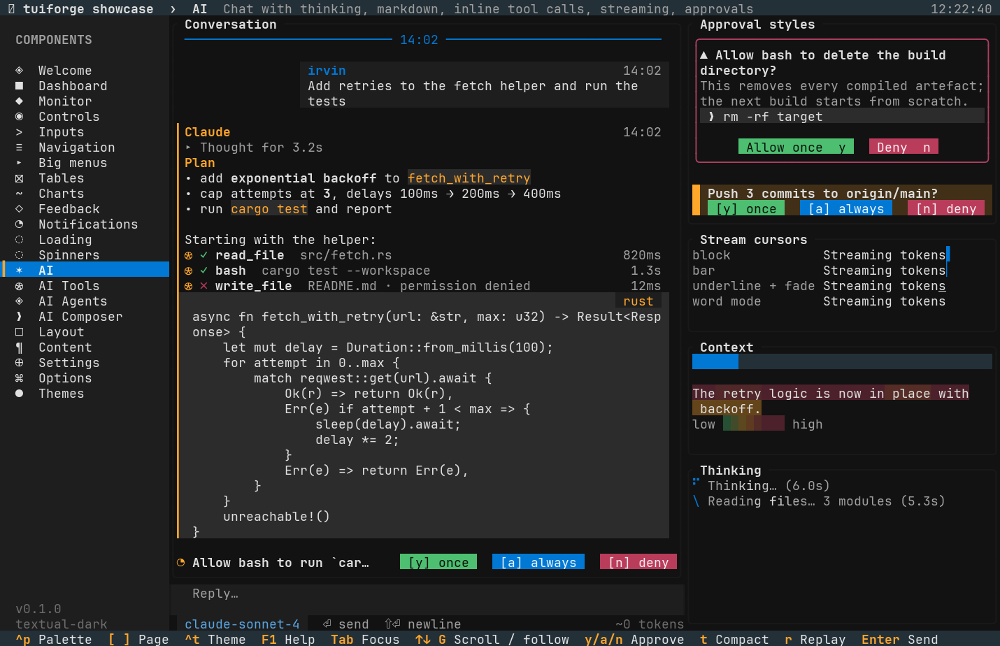
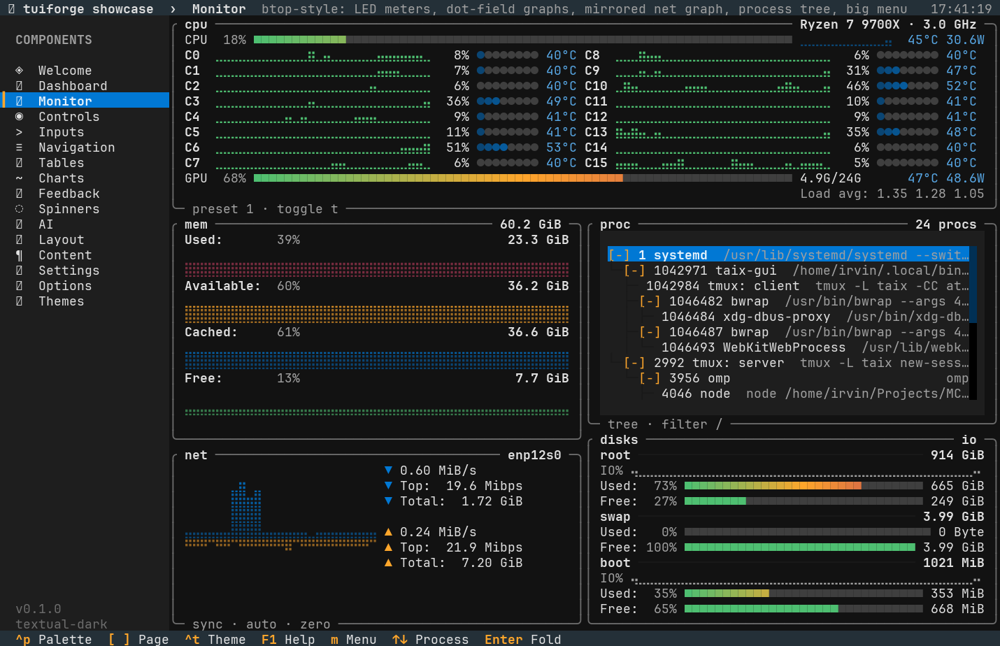
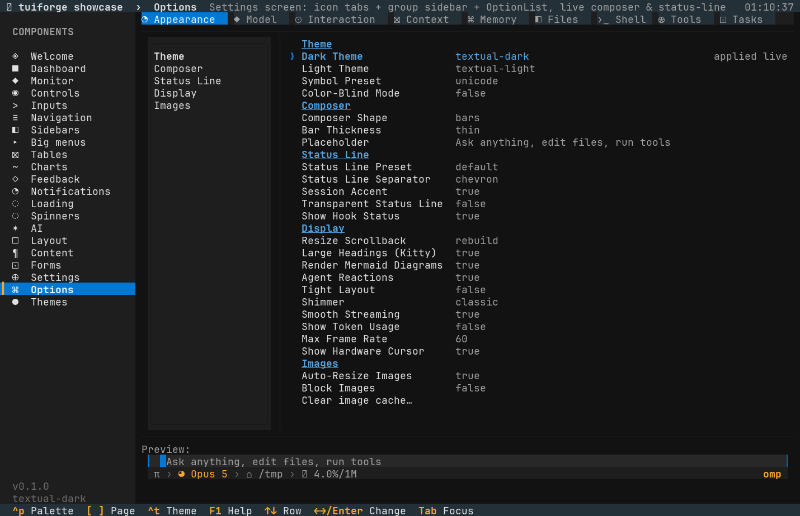
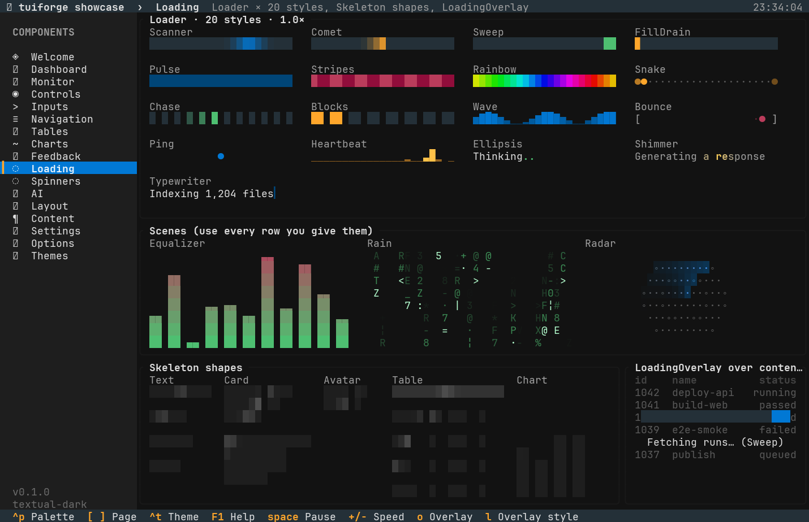
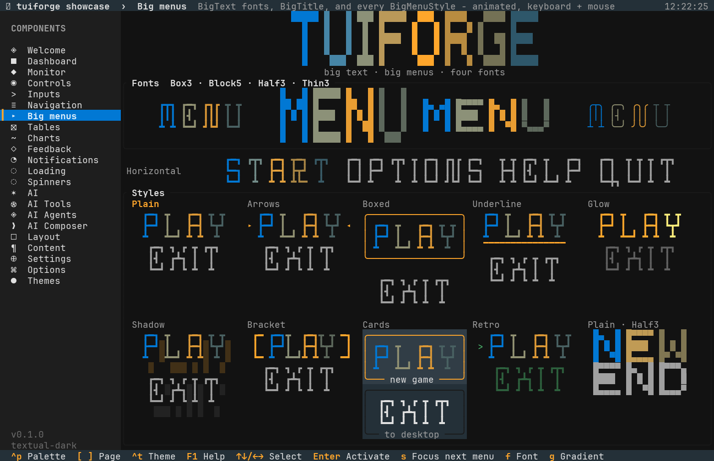
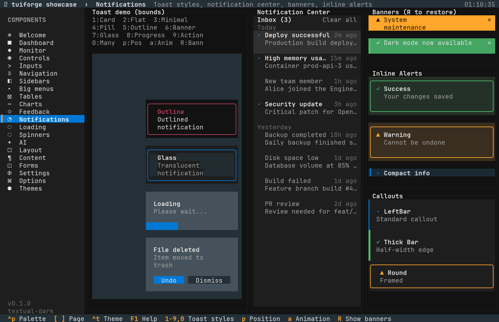
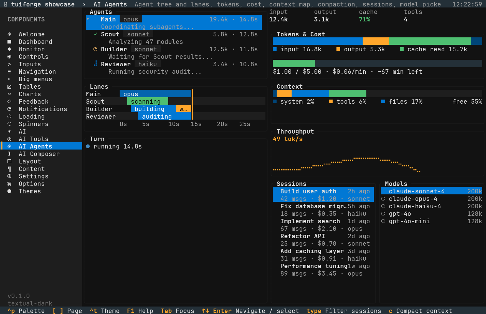
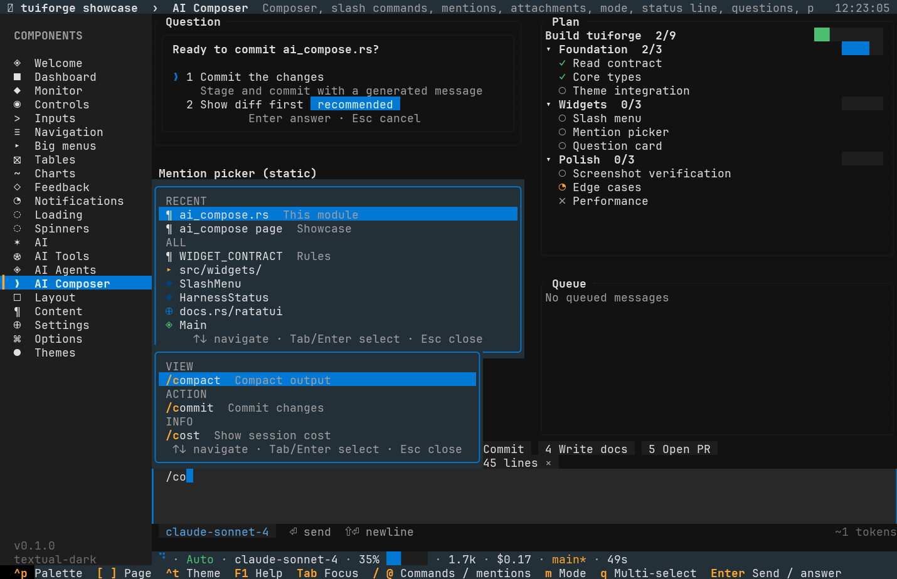

# tuiforge

**Textual-grade components for [ratatui](https://ratatui.rs).** A reusable widget library plus
design system that makes building rich, animated, mouse-aware terminal UIs in Rust take a
fraction of the code — and a `showcase` app that exercises all of it.

```toml
[dependencies]
tuiforge = { git = "https://github.com/irvin/tuiforge" }   # re-exports ratatui + crossterm
```

```
cargo run --release -p showcase            # the gallery
cargo run --release -p showcase -- --page charts --theme nord
```

`use tuiforge::prelude::*;` brings in every widget, the theme, layout and draw helpers plus the
ratatui types you need (`Rect`, `Buffer`, `Frame`, key/mouse events). `tuiforge::ratatui` and
`tuiforge::crossterm` are re-exported so your app does not need its own pinned versions.

## Why

ratatui gives you a buffer and a handful of widgets. Every app then re-implements focus
handling, hover, scrolling, dropdowns, dialogs, toasts, colour palettes and animation.
tuiforge ports the parts of [Textual](https://textual.textualize.io) that make it pleasant —
its colour system, its widget looks and its keyboard/mouse conventions — into plain ratatui
code with no runtime, no CSS engine and only two extra dependencies (`unicode-width`,
`unicode-segmentation`).

## The model — three things to learn

```rust
use tuiforge::prelude::*;

struct Demo { dark: SwitchState, name: InputState, focus: Focus<Id> }
#[derive(Clone, Copy, PartialEq)] enum Id { Dark, Name }

impl App for Demo {
    fn draw(&mut self, frame: &mut Frame, now: Instant) {
        let buf = frame.buffer_mut();
        let [a, b] = Layout::vertical([Constraint::Length(3), Constraint::Length(3)]).areas(center(frame.area(), 40, 7));
        // 1. a builder configures one frame …
        Switch::new().label("Dark mode").focused(self.focus.is(Id::Dark)).now(now)
            .render(a, buf, &mut self.dark);          // 2. … into a State that lives between frames
        Input::new().placeholder("Your name").focused(self.focus.is(Id::Name)).now(now)
            .render(b, buf, &mut self.name);
    }
    fn event(&mut self, ev: Event, _now: Instant) -> Flow {
        if let Event::Key(k) = &ev {
            if ctrl(k, 'c') { return Flow::Quit; }
            if self.focus.handle_key(*k).is_consumed() { return Flow::Continue; }   // Tab / ⇧Tab
        }
        // 3. events go to states and come back as an Outcome
        let out = match self.focus.current() {
            Some(Id::Dark) => self.dark.handle(&ev),
            Some(Id::Name) => self.name.handle(&ev),
            None => Outcome::Ignored,
        };
        if out.is_changed() { /* value changed: react */ }
        Flow::Continue
    }
    fn animating(&self, now: Instant) -> bool { self.dark.animating(now) }
}

fn main() -> std::io::Result<()> {
    theme::set_by_name("nord");
    run(&mut Demo { dark: SwitchState::new(true), name: InputState::new(), focus: Focus::new([Id::Dark, Id::Name]) })
}
```

* **Builder + State.** `Widget::new().option(..).render(area, buf, &mut state)`. Builders are
  cheap per-frame values; states own values, hover/press tracking, tweens and scroll offsets.
* **`Interactive` → `Outcome`.** `state.handle(&event)` (or `handle_key` / `handle_mouse`) returns
  `Ignored`, `Consumed` (redraw) or `Changed` (the value changed). Mouse hit-testing uses the
  rects cached during `render`, so you never compute layout twice.
* **`App` + `run`.** The runtime sets up the terminal (mouse capture, panic-safe restore) and
  redraws at 60 fps only while `animating()` is true.

Focus is owned by the app through `Focus<Id>`; hover is tracked by each state's `HitBox`.
Overlays (dropdowns, menus, tooltips, dialogs, palettes, toasts) render last via
`render_overlay(..)` / dedicated stack widgets.

## Reuse & customize

Every widget follows the same four knobs, so once you know one you know them all:

```rust
use tuiforge::prelude::*;

// theme: process-wide by name / spec, or per widget
theme::set_by_name("catppuccin-mocha");
let mine = Theme::resolve(&ThemeSpec::new("mine", true, Rgb::hex(0x7c3aed)), None);
Button::new("Save").theme(&mine).render(area, buf, &mut state);

// time: pass the frame instant; looping animations phase from a shared epoch
Spinner::new(&spinners::DOTS).now(now).render(area, buf);
Spinner::new(&spinners::SPARKLE).elapsed(1.25).render(area, buf);     // deterministic (tests)

// look: focus is yours, hover is the widget's, variants are semantic
Button::new("Delete").variant(Variant::Error).style(ButtonStyle::Outline).focused(is_focused);

// chrome thickness: every text field takes a shape; accent bars take an Edge
Input::new().shape(FieldShape::Bars(Edge::Hair));          // omp-style thin side bars
PromptComposer::new().shape(FieldShape::Band);              // Claude Code's padded › band
TextArea::new().shape(FieldShape::Rule);                    // a line above and below
ChatView::new().bar(Edge::Thin);                            // role bar: Hair / Thin / Half / Full

// your own content: borrow slices, nothing is copied until it is drawn
const PULSE: SpinnerDef = SpinnerDef::new("pulse", 120, &["·", "•", "●", "•"]);
Spinner::new(&PULSE);
Spinner::frames(&frames_from_config, 90);
```

* **Drawing primitives are public.** `draw::{Border, put, fill, hbar, wrap, truncate, st}` and
  `layout::{stack, columns, center, popup_below}` are the same functions the widgets use, so a
  custom widget looks native. `docs/WIDGET_CONTRACT.md` is the checklist.
* **State is plain data.** `<Name>State` structs are `Clone + Debug` with public fields; persist
  them, diff them, build them in tests. `Theme` is `Copy`.
* **No hidden globals except two:** `theme::current()` (overridable per widget) and
  `anim::EPOCH` (overridable with `.elapsed(secs)`).

## Design system

`theme.rs` is a port of Textual's `ColorSystem`: a palette of ~10 colours expands into 30+
semantic roles (`text`, `text-muted`, `text-disabled`, `panel`, `boost`, `border`,
`border-blurred`, `cursor`, `hover`, `selection`, `scrollbar`, `footer-key`…) using CIE-Lab
lightness steps and contrast-aware `auto N%` text. Twelve palettes ship (`textual-dark`,
`textual-light`, `nord`, `gruvbox`, `catppuccin-mocha`, `catppuccin-latte`, `dracula`,
`tokyo-night`, `monokai`, `flexoki`, `solarized-light`, `rose-pine`); build your own with
`ThemeSpec::new(..)`. `theme::set(..)` switches every widget at once; any builder can still
take an explicit `.theme(&Theme)`.

## Widget catalogue

| Family | Widgets |
|---|---|
| Controls | `Button` (3D / flat / outline / ghost, compact, icon), `Checkbox` + `CheckList` (tri-state; `CheckStyle`: pill / `[x]` / `☑` / `●` / `✓` / `■`), `Switch` (animated; `SwitchStyle`: pill / slim / line / round / `ON`·`OFF` / `✓`·`✗`), `RadioGroup` (`RadioStyle`: dot / `(•)` / `✓` / `❯`), `Segmented` (`SegmentedStyle`: filled / outline / underline / text), `Slider` + `RangeSlider` (frameless by default, `.shape(..)` for a focus frame), `Stepper`, `Rating` |
| Text entry | `Input` (selection, validation, restrict, suggester, password, prefix/suffix), `TextArea` (line numbers, undo/redo, highlighter hook, `CursorStyle` block / bar / underline / outline, blink, cursor kept visible when unfocused, `Ln, Col` indicator, click-to-position, wheel), `Select`, `Combobox` (fuzzy), `MultiSelect` (`DropdownWidth::Auto / Field / Fixed`) - all with `.shape(FieldShape)`: Textual `Tall`, thin side `Bars`/`Bar` of any `Edge` thickness, `Rule`, `Round`, `Prompt`, `Band` (Claude Code's padded `›` band), `None` |
| Navigation | `TabBar` (underline / boxed / pills / segmented / minimal, closable, animated), `TabbedContent`, `ListView` (filter, multi-select, details), `TreeView` (guides, expand/collapse), `MenuBar` + `ContextMenu` (submenus, shortcuts), `Breadcrumbs`, `Paginator` |
| Data | `DataTable` (sortable, zebra, row/cell cursor, multi-select, column resize, filter), `KeyValueList`, `Digits` (Textual big numerals) |
| Charts | `SparkChart` (bars, braille line/area, btop dot `Field`, `mirrored`), `BarGraph` (grouped, horizontal), `LineGraph` (braille, area, grid, legend), `ScatterPlot`, `Heatmap`, `ActivityGraph`, `Meter` (line / block / segments / LED `Blocks` / `Dots`, gradient, suffix), `RadialGauge`, `BrailleCanvas` |
| Feedback | `ProgressBar` (tweened, ETA, indeterminate), `StepProgress`, `Spinner` + `spinners::*` (all 90 [yaspin](https://github.com/pavdmyt/yaspin) / cli-spinners + 12 originals: `SPARKLE`, `RING`, `WAVE`, `EQUALIZER`, `SCANNER`, `SHIMMER`, `DNA`, `MATRIX`…), `LoadingIndicator`, `Marquee`, `Blinker`, `Callout` (`LeftBar` / `Bar(Edge)` / `Round`), `Modal` (confirm / alert / prompt), `CommandPalette` (fuzzy), `Tooltip` |
| Notifications | `Toaster`/`ToastStack` × 10 `ToastStyle`s (`Card`, `Flat`, `Minimal`, `Pill`, `Outline`, `Banner`, `Glass`, `Progress` with a live value, `Action` with inline buttons + `take_action()`, `Grouped` `+N more`), 6 `ToastPosition`s, `ToastAnim` slide / fade / pop, pause-on-hover, `dismiss(id)`; `NotificationCenter` (grouped inbox, unread dots, mark read / dismiss / clear all, filter, scroll), `Banner` (`Solid` / `Tinted` / `Outline`, action + close), `InlineAlert` (framed or `compact` one-row), `count_badge` |
| Loading | `Loader` × 20 `LoaderStyle`s - bars: `Scanner`, `Comet`, `Sweep`, `FillDrain`, `Pulse`, `Stripes`, `Rainbow`, `Snake`, `Chase`, `Blocks`, `Wave`, `Bounce`, `Ping`, `Heartbeat`; text: `Ellipsis`, `Shimmer`, `Typewriter`; scenes: `Equalizer`, `Rain`, `Radar` (`.label`, `.color/.color2`, `.speed`); `Skeleton` (`Text` / `Card` / `Avatar` / `List` / `Table` / `Chart`, painted bars, smooth diagonal sweep); `LoadingOverlay` (dim any area, centred loader + message) |
| AI chat | `ChatView` (bubbles, timestamps, hover, compact, `▾ N new` pill) over `ChatMessage`s made of `ChatBlock`s: `Text` (inline markdown: `**bold**`, `` `code` ``, bullets, headings), `Code` (painted language chip), `Thinking` (collapsible `▸ Thought for 3.1s`, shimmer while streaming, click to toggle), `ToolCall` (status glyph / spinner, duration), `Divider`; `ChatState::begin_stream` / `stream_tick` reveal text at N cps; `TypingIndicator`; `StreamText` (`StreamCursor` block / bar / underline, `fade`, `word_mode`); `Thinking` (any catalog spinner, elapsed label); `Approval` × `ApprovalStyle` `Card` / `Inline` (one row) / `Banner`, `.command` preview, `.danger` (pulsing red, no *Always*); `ContextGauge` (any `MeterStyle` + gradient), `TokenHeat`, `DiffView`, `PromptComposer` (any `FieldShape`) |
| AI tools | `ToolTimeline` (nested steps with guides, live elapsed, expandable output), `ShellBlock` (command + cwd, streaming stdout/stderr, exit pill, collapse), `CodeBlock` (gutter, highlighter hook, caret), `EditPreview` (animated diff reveal, side-by-side, accept / reject / edit), `ChangeSet` (A/M/D/R badges, +/− bars, footer), `JsonTree` + `Json::parse` (collapsible, typed colours), `RetryNotice` (countdown bar) |
| AI agents | `AgentTree` (status glyphs, model chips, tokens · elapsed, tasks, collapse), `AgentLanes` (gantt with painted spans, live marker, auto-scroll, axis), `TokenMeter` (stacked input / output / cache), `CostMeter` (tweened spend vs budget, rate, time left), `ContextMap` (proportional segments + legend), `CompactionBanner` (eased 78% → 31%), `TurnStats` (KPI cells), `RateGraph` (tok/s + sparkline), `SessionList` (fuzzy filter), `ModelPicker` (provider, context, prices, capability chips), `ElapsedTimer`, `fmt_duration`, `fmt_usd` |
| AI composer | `SlashMenu` + `MentionPicker` (anchored popups, fuzzy ranking with highlighted matches, categories / RECENT, keyboard + mouse), `AttachmentChips` (× to remove, overflow `+N`), `ModeBadge` (`HarnessMode` Plan / Act / Ask / Auto, animated colour swap), `HarnessStatus` (one-row status that drops segments by priority), `QuestionCard` (single / multi, digits, recommended chip), `PlanView` (phases with progress bars, task states), `MessageQueue`, `Suggestions` chips |
| Layout & chrome | `SplitPane` (draggable), `ScrollView` (offscreen buffer, smooth), `Scrollbar`, `Panel` (title, right title, footer keys, badge) / card / section, `Collapsible` + `Accordion`, `AppHeader`, `KeyFooter`, `StatusLine` (segments + separators), `Placeholder` |
| Menus & settings | `OptionList` (grouped `label  value` rows, cursor, in-place bool/choice/int cycling, group index for a sidebar), `BigText` × 4 `BigFont`s (`Box3` heavy strokes, `Thin3` rounded, `Block5` painted 5×5 pixels, `Half3` half-block) + `BigTitle`, `BigMenu` × 10 `BigMenuStyle`s (`Plain`, `Arrows`, `Boxed`, `Underline` (sliding), `Glow` (sweep), `Shadow`, `Bracket`, `Horizontal`, `Cards` + descriptions, `Retro` blink), `CommandPalette`, `MenuBar` |
| Content | `Label`, `Rule`, `Badge`, `Pill`, `KeyCap`, `Link`, `StatCard`, `Markup` (Rich-style `[b]…[/b]`), `Markdown`, `LogView`, `Calendar` + `DatePicker`, `Swatches`, `ColorPicker`, `GradientBar`, `ThemePalette`, `Steps`, `Timeline` |

Foundation modules: `core` (Outcome, Look, Focus, HitBox, key helpers), `draw` (clipped text,
16 border styles with titles, eighth-block bars, blending, wrapping), `layout` (centring,
grids, flow, popup placement, overlay queue), `anim` (tweens, easings, pulses, blinks, shared
epoch), `fuzzy`, `runtime` (app loop, local clock, civil dates).

Examples: `cargo run -p tuiforge --example minimal` (switch + input + button) and
`--example custom` (own `ThemeSpec`, own `SpinnerDef`, chat + composer + context gauge).
Regenerate the spinner catalog from `tools/spinners.json` with `python tools/gen_spinners.py`.

## Showcase

`showcase/` is a 22-page gallery: Welcome, Dashboard (everything composed on one screen),
Monitor (btop-style: LED meters, dot-field graphs, mirrored net graph, process tree, big-font
menu on `m`), Controls, Inputs, Navigation, Big menus (4 fonts, `Horizontal` strip, 10 vertical
styles; `s`/`f`/`g`), Tables, Charts, Feedback, Notifications (`1`–`9`/`0` fire every toast
style, `p`/`a` position and animation, inbox, banners, inline alerts), Loading (all 20 loader
styles, scenes, skeletons, overlay; space pauses, `+`/`-` speed), Spinners (the whole
catalog, filterable, with the one-liner for each), the AI harness section - AI (a replayed
turn: thinking, markdown, inline tool calls, streaming, approvals), AI Tools (tool timeline,
shell/code blocks, edit preview, change set, JSON tree), AI Agents (agent tree and lanes,
tokens, cost, context map, compaction, sessions, models), AI Composer (slash commands,
mentions, attachments, mode, status line, questions, plan, queue) - Layout, Content, Settings
(a complete preferences form in ~300 lines), Options (omp-style settings screen: icon tabs +
group sidebar + `OptionList`, with a live composer-shape / status-line preview), Themes (live
primary-hue override).

Keys: `]`/`[` pages, `alt+1..9` jump, `^p` palette, `^t` theme, `^b` sidebar, `F1` help,
`F3` reduce motion, `Tab` focus, mouse everywhere.

Headless screenshots for review/CI: `python tools/shot.py -s 130x42 -k "Tab Enter" -o out.png -- ./target/release/showcase --page inputs`.

| Dashboard | Controls |
|---|---|
|  |  |
| **Inputs** | **Charts** |
|  |  |
| **Feedback** (toasts, nord) | **Settings** |
|  |  |
| **Navigation** | **Tables** |
|  |  |
| **Layout** | **Content** |
|  |  |
| **Themes** | **Command palette** (nord) |
|  |  |
| **AI** (a replayed harness turn: thinking, markdown, tool calls, approval) | **Spinners** (102-entry catalog) |
|  |  |
| **Monitor** (btop-style) | **Options** (omp-style settings) |
|  |  |
| **Loading** (20 loader styles, skeletons, overlay) | **Welcome** |
|  |  |
| **Big menus** (4 fonts, 10 styles) | **Notifications** (toast styles, inbox, banners, alerts) |
|  |  |
| **AI Tools** | **AI Agents** |
|  |  |
| **AI Composer** | |
|  | |

## Writing a widget

See [`docs/WIDGET_CONTRACT.md`](docs/WIDGET_CONTRACT.md) — the rules every widget in this repo
follows (builder + state, `Interactive`, cached rects, theme fallback, no panics at any size,
tests per module). `tuiforge/src/widgets/scrollbar.rs` is the reference implementation.

## Status

Early but complete: 80+ widgets, 102 spinners, 170+ tests, zero `unsafe`, MSRV 1.88
(edition 2024). Not affiliated with Textualize; the design language is theirs, the code is not.
