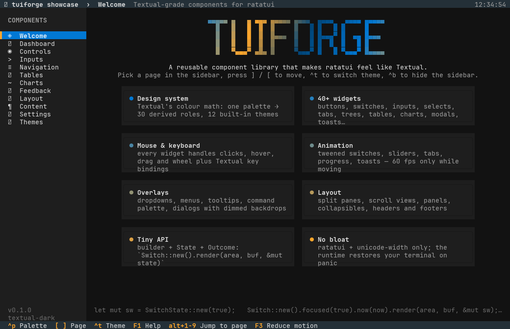

# tuiforge

**Textual-grade components for [ratatui](https://ratatui.rs).** A reusable widget library plus
design system that makes building rich, animated, mouse-aware terminal UIs in Rust take a
fraction of the code — and a `showcase` app that exercises all of it.

```
cargo run --release -p showcase            # the gallery
cargo run --release -p showcase -- --page charts --theme nord
```

## Why

ratatui gives you a buffer and a handful of widgets. Every app then re-implements focus
handling, hover, scrolling, dropdowns, dialogs, toasts, colour palettes and animation.
tuiforge ports the parts of [Textual](https://textual.textualize.io) that make it pleasant —
its colour system, its widget looks and its keyboard/mouse conventions — into plain ratatui
code with no runtime, no CSS engine and only two extra dependencies (`unicode-width`,
`unicode-segmentation`).

## The model — three things to learn

```rust
use tuiforge::prelude::*;

struct Demo { dark: SwitchState, name: InputState, focus: Focus<Id> }
#[derive(Clone, Copy, PartialEq)] enum Id { Dark, Name }

impl App for Demo {
    fn draw(&mut self, frame: &mut Frame, now: Instant) {
        let buf = frame.buffer_mut();
        let [a, b] = Layout::vertical([Constraint::Length(3), Constraint::Length(3)]).areas(center(frame.area(), 40, 7));
        // 1. a builder configures one frame …
        Switch::new().label("Dark mode").focused(self.focus.is(Id::Dark)).now(now)
            .render(a, buf, &mut self.dark);          // 2. … into a State that lives between frames
        Input::new().placeholder("Your name").focused(self.focus.is(Id::Name)).now(now)
            .render(b, buf, &mut self.name);
    }
    fn event(&mut self, ev: Event, _now: Instant) -> Flow {
        if let Event::Key(k) = &ev {
            if ctrl(k, 'c') { return Flow::Quit; }
            if self.focus.handle_key(*k).is_consumed() { return Flow::Continue; }   // Tab / ⇧Tab
        }
        // 3. events go to states and come back as an Outcome
        let out = match self.focus.current() {
            Some(Id::Dark) => self.dark.handle(&ev),
            Some(Id::Name) => self.name.handle(&ev),
            None => Outcome::Ignored,
        };
        if out.is_changed() { /* value changed: react */ }
        Flow::Continue
    }
    fn animating(&self, now: Instant) -> bool { self.dark.animating(now) }
}

fn main() -> std::io::Result<()> {
    theme::set_by_name("nord");
    run(&mut Demo { dark: SwitchState::new(true), name: InputState::new(), focus: Focus::new([Id::Dark, Id::Name]) })
}
```

* **Builder + State.** `Widget::new().option(..).render(area, buf, &mut state)`. Builders are
  cheap per-frame values; states own values, hover/press tracking, tweens and scroll offsets.
* **`Interactive` → `Outcome`.** `state.handle(&event)` (or `handle_key` / `handle_mouse`) returns
  `Ignored`, `Consumed` (redraw) or `Changed` (the value changed). Mouse hit-testing uses the
  rects cached during `render`, so you never compute layout twice.
* **`App` + `run`.** The runtime sets up the terminal (mouse capture, panic-safe restore) and
  redraws at 60 fps only while `animating()` is true.

Focus is owned by the app through `Focus<Id>`; hover is tracked by each state's `HitBox`.
Overlays (dropdowns, menus, tooltips, dialogs, palettes, toasts) render last via
`render_overlay(..)` / dedicated stack widgets.

## Design system

`theme.rs` is a port of Textual's `ColorSystem`: a palette of ~10 colours expands into 30+
semantic roles (`text`, `text-muted`, `text-disabled`, `panel`, `boost`, `border`,
`border-blurred`, `cursor`, `hover`, `selection`, `scrollbar`, `footer-key`…) using CIE-Lab
lightness steps and contrast-aware `auto N%` text. Twelve palettes ship (`textual-dark`,
`textual-light`, `nord`, `gruvbox`, `catppuccin-mocha`, `catppuccin-latte`, `dracula`,
`tokyo-night`, `monokai`, `flexoki`, `solarized-light`, `rose-pine`); build your own with
`ThemeSpec::new(..)`. `theme::set(..)` switches every widget at once; any builder can still
take an explicit `.theme(&Theme)`.

## Widget catalogue

| Family | Widgets |
|---|---|
| Controls | `Button` (3D / flat / outline / ghost, compact, icon), `Checkbox` (tri-state), `Switch` (animated), `RadioGroup`, `CheckList`, `Segmented`, `Slider`, `RangeSlider`, `Stepper`, `Rating` |
| Text entry | `Input` (selection, validation, restrict, suggester, password, prefix/suffix), `TextArea` (line numbers, undo/redo, highlighter hook), `Select`, `Combobox` (fuzzy), `MultiSelect` |
| Navigation | `TabBar` (underline / boxed / pills / segmented / minimal, closable, animated), `TabbedContent`, `ListView` (filter, multi-select, details), `TreeView` (guides, expand/collapse), `MenuBar` + `ContextMenu` (submenus, shortcuts), `Breadcrumbs`, `Paginator` |
| Data | `DataTable` (sortable, zebra, row/cell cursor, multi-select, column resize, filter), `KeyValueList`, `Digits` (Textual big numerals) |
| Charts | `SparkChart`, `BarGraph` (grouped, horizontal), `LineGraph` (braille, area, grid, legend), `ScatterPlot`, `Heatmap`, `ActivityGraph`, `Meter`, `RadialGauge`, `BrailleCanvas` |
| Feedback | `ProgressBar` (tweened, ETA, indeterminate), `StepProgress`, `Spinner` (17 kinds), `LoadingIndicator`, `Skeleton`, `Marquee`, `Blinker`, `Toaster`/`ToastStack`, `Callout`, `Modal` (confirm / alert / prompt), `CommandPalette` (fuzzy), `Tooltip` |
| Layout & chrome | `SplitPane` (draggable), `ScrollView` (offscreen buffer, smooth), `Scrollbar`, `Panel` / card / section, `Collapsible` + `Accordion`, `AppHeader`, `KeyFooter`, `Placeholder` |
| Content | `Label`, `Rule`, `Badge`, `Pill`, `KeyCap`, `Link`, `StatCard`, `Markup` (Rich-style `[b]…[/b]`), `Markdown`, `LogView`, `Calendar` + `DatePicker`, `Swatches`, `ColorPicker`, `GradientBar`, `ThemePalette`, `Steps`, `Timeline` |

Foundation modules: `core` (Outcome, Look, Focus, HitBox, key helpers), `draw` (clipped text,
16 border styles with titles, eighth-block bars, blending, wrapping), `layout` (centring,
grids, flow, popup placement, overlay queue), `anim` (tweens, easings, pulses, blinks),
`fuzzy`, `runtime` (app loop, local clock, civil dates).

## Showcase

`showcase/` is a 12-page gallery: Welcome, Dashboard (everything composed on one screen),
Controls, Inputs, Navigation, Tables, Charts, Feedback, Layout, Content, Settings (a complete
preferences form in ~300 lines), Themes (live primary-hue override).

Keys: `]`/`[` pages, `alt+1..9` jump, `^p` palette, `^t` theme, `^b` sidebar, `F1` help,
`F3` reduce motion, `Tab` focus, mouse everywhere.

Headless screenshots for review/CI: `python tools/shot.py -s 130x42 -k "Tab Enter" -o out.png -- ./target/release/showcase --page inputs`.

| Dashboard | Controls |
|---|---|
| 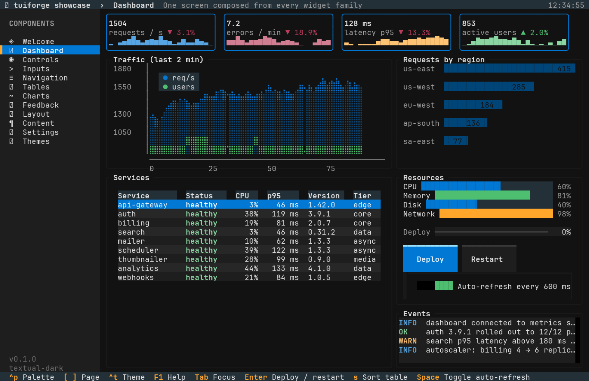 | 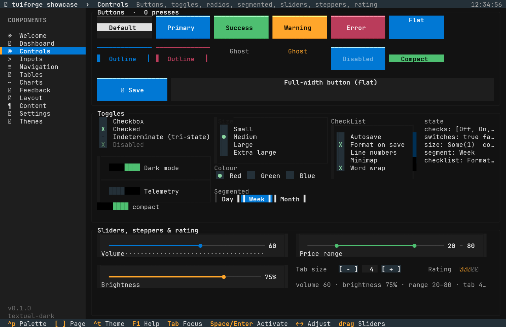 |
| **Inputs** | **Charts** |
| 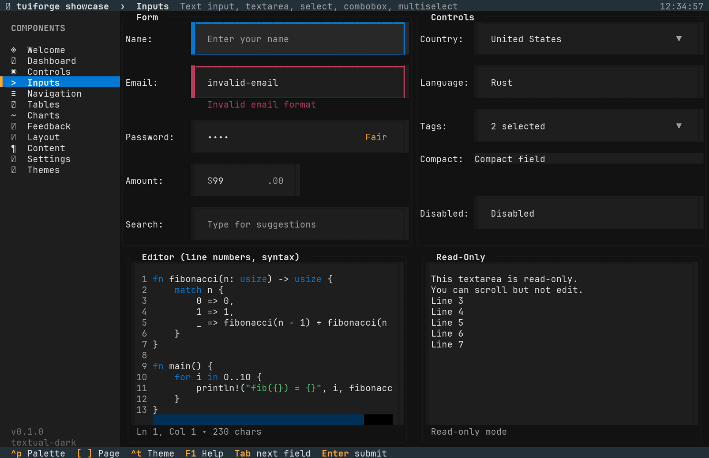 | 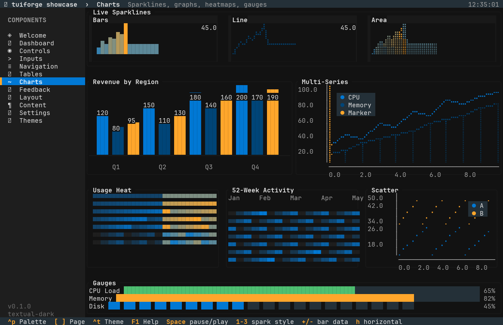 |
| **Feedback** (toasts, nord) | **Settings** |
| 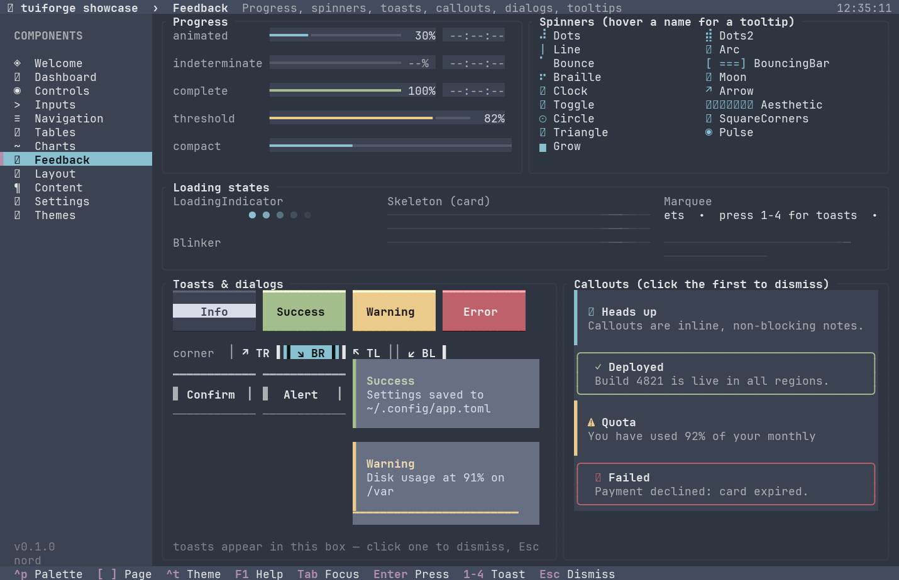 | 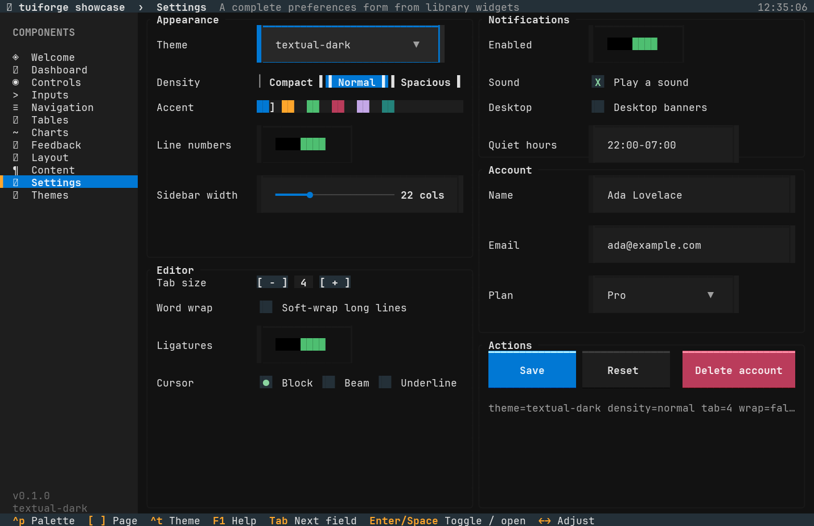 |
| **Navigation** | **Tables** |
| 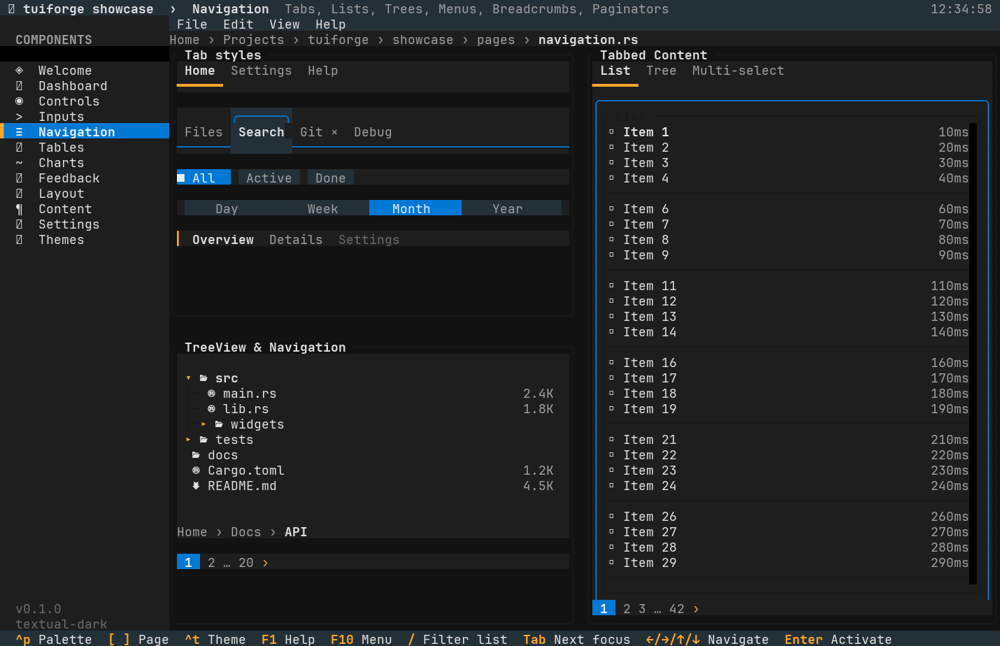 | 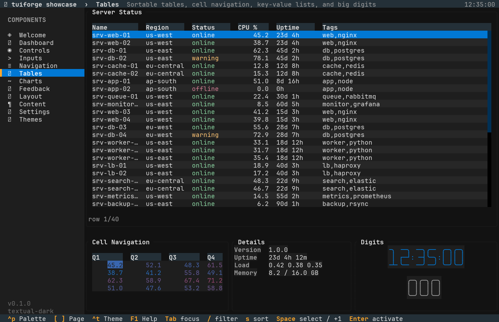 |
| **Layout** | **Content** |
| 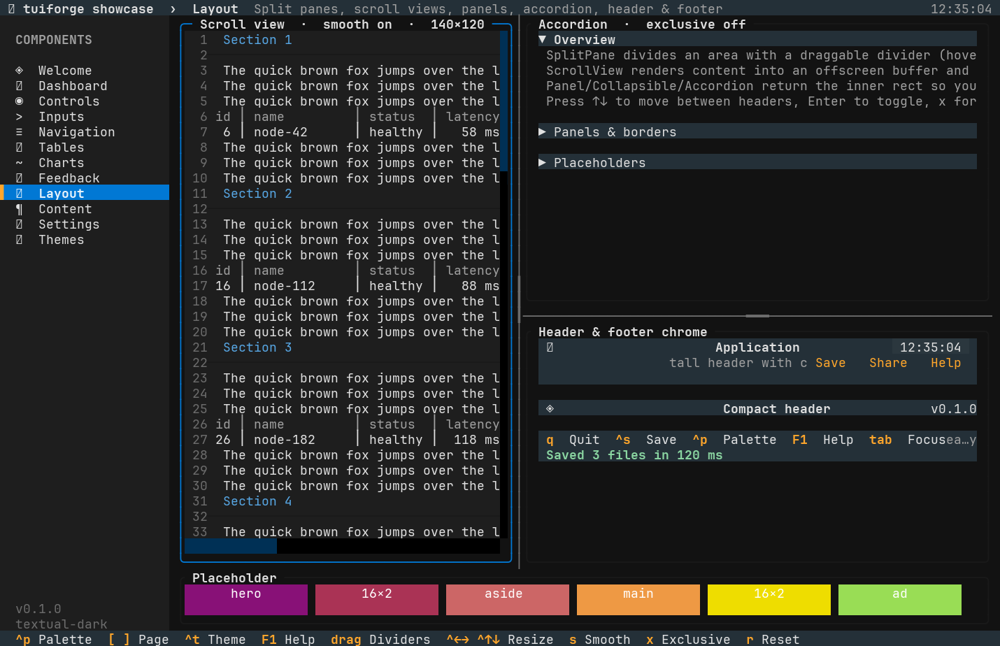 | 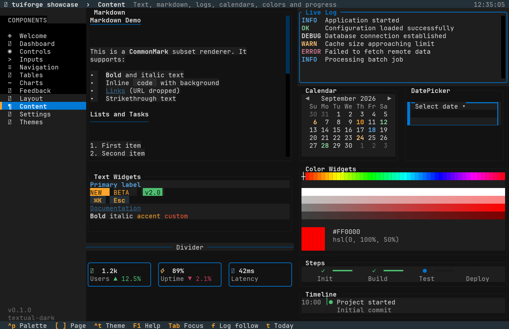 |
| **Themes** | **Command palette** (nord) |
| 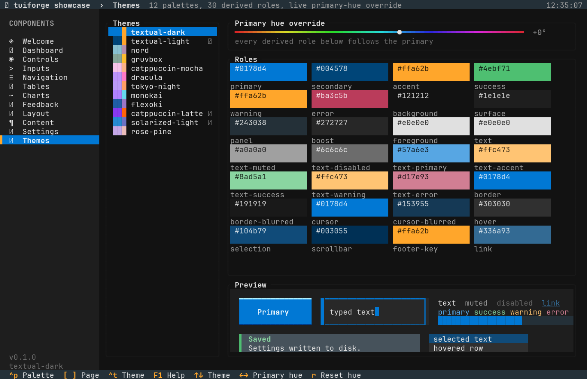 | 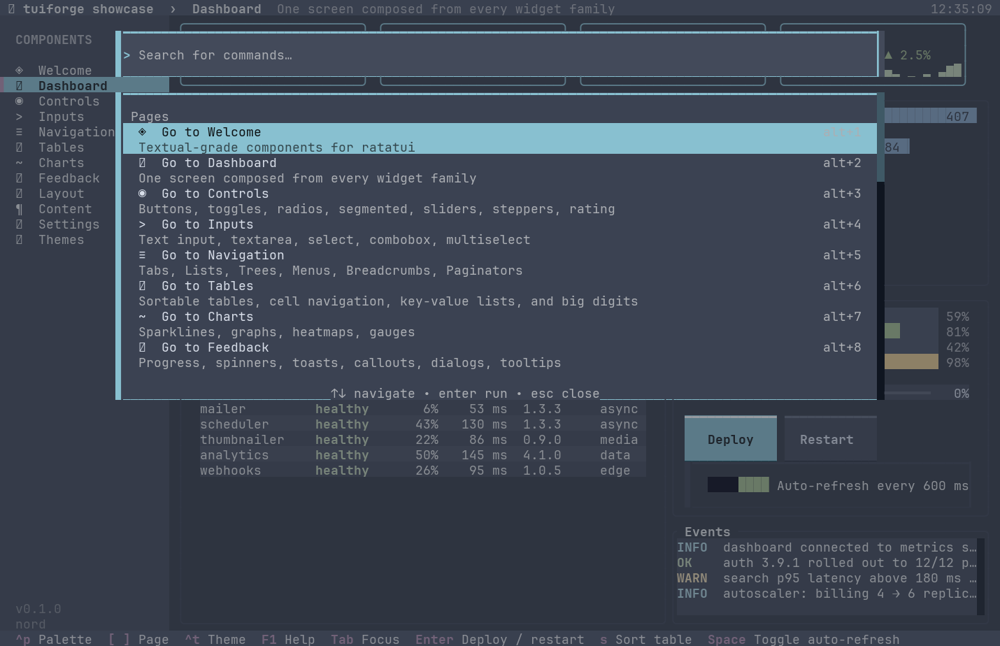 |

## Writing a widget

See [`docs/WIDGET_CONTRACT.md`](docs/WIDGET_CONTRACT.md) — the rules every widget in this repo
follows (builder + state, `Interactive`, cached rects, theme fallback, no panics at any size,
tests per module). `tuiforge/src/widgets/scrollbar.rs` is the reference implementation.

## Status

Early but complete: 70+ widgets, 120+ unit tests, zero `unsafe`, MSRV = current stable
(edition 2024). Not affiliated with Textualize; the design language is theirs, the code is not.
