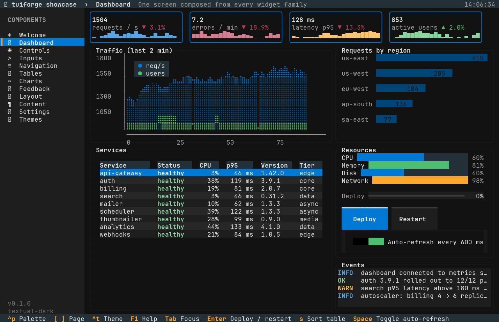

# A dashboard

A dashboard is a grid of panels that each own one widget, refreshed from data your app
already has. The interesting parts are the layout, deciding what animates, and keeping the
redraw cost honest.



## Splitting the screen

```rust
# extern crate tuile;
# extern crate ratatui;
# use tuile::prelude::*;
# fn layout_demo(area: Rect) {
let [header, body, footer] = Layout::vertical([
    Constraint::Length(1),
    Constraint::Fill(1),
    Constraint::Length(1),
])
.areas(area);

let [left, right] = Layout::horizontal([Constraint::Percentage(60), Constraint::Fill(1)])
    .areas(body);

let cards = columns(left, 3, 1);        // three equal columns, one cell of gap
# let _ = (header, footer, right, cards);
# }
# fn main() {}
```

ratatui's `Layout` handles the main structure. tuile adds the helpers that are tedious to
write with constraints: `columns(area, n, gap)`, `stack(area, &heights, gap)`,
`center(area, w, h)` and `pad(area, x, y)`. Use whichever is shorter at each point.

## Stat cards

```rust
# extern crate tuile;
# extern crate ratatui;
# use tuile::prelude::*;
# fn demo(area: Rect, buf: &mut Buffer) {
let cards = columns(area, 3, 1);

StatCard::new("Requests", "12.4k").delta(8.2, true).variant(Variant::Success).render(cards[0], buf);
StatCard::new("Errors", "37").delta(12.0, false).variant(Variant::Error).render(cards[1], buf);
StatCard::new("p99", "412ms").render(cards[2], buf);
# }
# fn main() {}
```

Stat cards are stateless. Build them from your data each frame and pass no state at all.

## A panel with a chart inside

```rust
# extern crate tuile;
# extern crate ratatui;
# use tuile::prelude::*;
# fn demo(area: Rect, buf: &mut Buffer, samples: &[f64]) {
let th = theme::current();
let inner = Border::Panel.draw_titled(
    buf, area, th.border_blurred, th.background, "Throughput", Alignment::Left,
);
SparkChart::new(samples).style(SparkStyle::Area).render(inner, buf);
# }
# fn main() {}
```

Every border helper returns the rectangle inside the frame, so the panel and its content are
two lines with no manual inset arithmetic.

`Panel` is the widget version with a title, an optional right title, footer keys and a badge.
Use the bare `Border` when you only need a frame.

## Choosing what animates

A dashboard that redraws at 60 fps forever is a dashboard that heats a laptop. `animating`
should be true only while something is genuinely moving:

```rust
# extern crate tuile;
# extern crate ratatui;
# use tuile::prelude::*;
# struct Dash { deploy: ProgressState, spinner_visible: bool, toasts: Toaster }
# impl Dash {
fn animating(&self, now: Instant) -> bool {
    self.deploy.animating(now) || self.spinner_visible || self.toasts.animating(now)
}
# }
# fn main() {}
```

A progress bar tweens toward its new value and then stops, so it reports honestly. A spinner
loops forever, so showing one permanently pins the frame rate; make its visibility a flag
tied to real work.

Charts do not animate on their own. They redraw when your data changes, which on a monitoring
screen is usually once a second. `RunOptions { idle_redraw: Some(Duration::from_secs(1)), .. }`
is a reasonable setting for a screen like that, with `animating` false most of the time.

## Feeding it data

tuile has no opinion about where data comes from. The usual shape is a worker thread and a
channel, drained in `update`:

```rust
# extern crate tuile;
# extern crate ratatui;
# use tuile::prelude::*;
use std::sync::mpsc::Receiver;

struct Dash {
    rx: Receiver<f64>,
    series: Vec<f64>,
}

impl Dash {
    fn update(&mut self, _now: Instant) {
        while let Ok(sample) = self.rx.try_recv() {
            self.series.push(sample);
            if self.series.len() > 240 {
                self.series.remove(0);
            }
        }
    }
}
# fn main() {}
```

`try_recv` in a loop, never a blocking `recv`: `update` runs on the draw thread and blocking
there freezes the interface.

For a series with a fixed window, `VecDeque` with `push_back` and `pop_front` avoids the
`remove(0)` shuffle. At 240 samples neither is measurable, and the chart widgets take any
`&[f64]`.

## Keeping one widget interactive

Most dashboard panels are read-only, and usually one is not: a table of hosts, a log view, a
list you can filter. Give that one widget the focus ring and leave the rest stateless.

```rust
# extern crate tuile;
# extern crate ratatui;
# use tuile::prelude::*;
# struct Dash { hosts: DataTableState }
# impl Dash {
fn event(&mut self, ev: &Event) -> Outcome {
    self.hosts.handle(ev)      // the only interactive panel
}
# }
# fn main() {}
```

When a second interactive panel arrives, add a `Focus<PanelId>` and route keys through it,
exactly as in the [form recipe](form.md). Mouse events can still go to everyone.

## What the showcase does

The Dashboard page composes stat cards, a bar graph, a line graph, a data table, meters, a
deploy button driving a progress bar, and an event log, all from one deterministic
simulation. The Monitor page is the denser btop-style version with LED meters, dot-field
graphs and a process tree. Both are single files under `showcase/src/pages/`.
