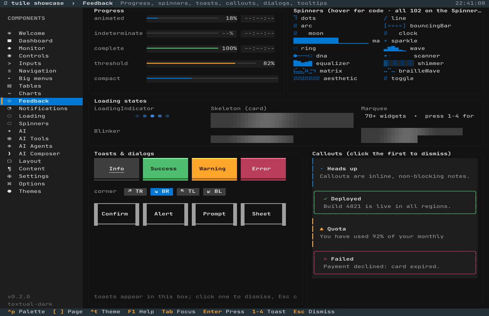

# Feedback

Progress indicators, spinners, loading states, messages, and overlays for keeping users informed.



## Progress bars

### ProgressBar

An animated horizontal bar with optional percentage and ETA. The state owns the target value and a tween that smoothly animates toward it.

```rust
# extern crate tuile;
# extern crate ratatui_core;
use tuile::prelude::*;
use std::time::{Duration, Instant};

# fn demo(area: Rect, buf: &mut Buffer, now: Instant) {
let mut state = ProgressState::default();
state.set(0.45, now, Duration::from_millis(300));

ProgressBar::new()
    .label("Downloading")
    .show_percentage(true)
    .show_eta(true)
    .variant(Variant::Primary)
    .render(area, buf, &mut state);
# }
# fn main() {}
```

The state tracks samples of `(Instant, value)` pairs and estimates time remaining. ETA appears after one second of progress and at least two samples. Call `state.set(new_value, now, duration)` each time the value changes; the tween interpolates over `duration`. Read `state.value(now)` for the current animated position.

Indeterminate mode shows a sweeping segment when the total is unknown:

```rust
# extern crate tuile;
# extern crate ratatui_core;
use tuile::prelude::*;
use std::time::Instant;

# fn demo(area: Rect, buf: &mut Buffer, now: Instant) {
let mut state = ProgressState::default();
state.tick_indeterminate(now, 0.5);

ProgressBar::new()
    .indeterminate()
    .label("Fetching")
    .render(area, buf, &mut state);
# }
# fn main() {}
```

Call `tick_indeterminate(now, speed)` each frame. The speed is cycles per second; 0.5 completes one sweep every two seconds.

| Method | Effect |
|--------|--------|
| `label(text)` | Left-aligned label |
| `show_bar(bool)` | Show the filled bar (default true) |
| `show_percentage(bool)` | Show percentage column (default true) |
| `show_eta(bool)` | Show estimated time remaining (default true) |
| `variant(Variant)` | Bar color (default Primary) |
| `indeterminate()` | Sweeping segment instead of value-based fill |
| `compact(bool)` | Single-row layout with no label row |
| `width_hint(u16)` | Reserve width for ETA so the bar does not resize |
| `background(Rgb)` | Custom background color |

### StepProgress

Dots for multi-step flows: `●●●○○` where filled dots mark completed steps.

```rust
# extern crate tuile;
# extern crate ratatui_core;
use tuile::prelude::*;

# fn demo(area: Rect, buf: &mut Buffer) {
StepProgress::new(5).current(3).render(area, buf);
# }
# fn main() {}
```

No state needed; pass the current step (zero-indexed) at render. Customize the glyphs with `filled(g)` and `empty(g)`.

## Spinners

### Spinner

Animated frame sequences from a catalog of 102 definitions. Every spinner in yaspin and cli-spinners plus tuile originals.

```rust
# extern crate tuile;
# extern crate ratatui_core;
use tuile::prelude::*;
use tuile::widgets::spinners;
use std::time::Instant;

# fn demo(area: Rect, buf: &mut Buffer, now: Instant) {
Spinner::new(&spinners::DOTS)
    .label("Loading")
    .now(now)
    .render(area, buf);
# }
# fn main() {}
```

The `spinners` module is a catalog of `const SpinnerDef` entries. Each definition holds a name, interval in milliseconds, and frame array. Pass `.now(instant)` to derive the phase from `crate::anim::EPOCH`, or `.elapsed(secs)` for an explicit phase. Tests use `.elapsed()` for deterministic frames.

```rust
# extern crate tuile;
# extern crate ratatui_core;
use tuile::prelude::*;
use tuile::widgets::spinners;

# fn example() {
let frame = spinners::DOTS.frame(1.5);
let width = spinners::DOTS.width();
# }
# fn main() {}
```

Call `SpinnerDef::frame(elapsed)` to read one frame at a given phase, or `SpinnerDef::width()` to reserve space for the widest frame.

Custom spinners:

```rust
# extern crate tuile;
# extern crate ratatui_core;
use tuile::prelude::*;
use std::time::Instant;

const PULSE: SpinnerDef = SpinnerDef::new("pulse", 120, &["·", "•", "●", "•"]);

# fn demo(area: Rect, buf: &mut Buffer, now: Instant) {
Spinner::new(&PULSE).now(now).render(area, buf);
Spinner::frames(&["<", "^", ">", "v"], 150).now(now).render(area, buf);
# }
# fn main() {}
```

Popular catalog entries: `DOTS`, `LINE`, `ARC`, `MOON`, `BOUNCING_BAR`, `CLOCK`, `SPARKLE`, `RING`, `WAVE`, `EQUALIZER`, `SCANNER`, `MATRIX`. The full list lives in `tuile::widgets::spinners::ALL`.

| Method | Effect |
|--------|--------|
| `label(text)` | Right-aligned label after the spinner |
| `color(Rgb)` | Custom foreground color |
| `now(Instant)` | Current instant (phase from EPOCH) |
| `elapsed(f32)` | Explicit phase in seconds |

### LoadingIndicator, Marquee, Blinker

**LoadingIndicator**: Five dots pulsing through a gradient. Defaults to theme primary; customize with `colors(a, b)` for gradient endpoints or `dots(n)` for count.

**Marquee**: Horizontally scrolling text. Set `speed(cells_per_sec)` and `gap(cells)` for spacing before repeat. Useful for status lines.

**Blinker**: Simple blinking glyph. The glyph is visible for the first half of each `period(secs)`. Default period is 1.0 second, default glyph is `●`.

All three take `.now(Instant)` or `.elapsed(f32)` for phase control.

## Messages

### Callout

Inline bordered notes for heads-up messages. Not dismissible by default; set `dismissible(true)` and the state tracks clicks.

```rust
# extern crate tuile;
# extern crate ratatui_core;
use tuile::prelude::*;
use tuile::widgets::CalloutBorder;

# fn demo(area: Rect, buf: &mut Buffer) {
let mut state = CalloutState::default();
Callout::new("Deployed", "Build 4821 is live in all regions.")
    .variant(Variant::Success)
    .border_style(CalloutBorder::Round)
    .dismissible(true)
    .render(area, buf, &mut state);
# }
# fn main() {}
```

Three border styles: `LeftBar` (thin left edge), `Bar(Edge)` (left edge with custom thickness), and `Round` (rounded corners). The variant colors the border and background tint.

When `dismissible(true)`, clicking the callout sets `state.dismissed` to true and the widget stops rendering.

## Overlays

Modal and CommandPalette are overlay widgets. Render them last in your frame so they appear above other content, and check the overlays concept page for stacking and focus rules: [Overlays](../concepts/overlays.md).

### Modal

Dialogs with a dimmed backdrop. Three presets: `confirm`, `alert`, and `prompt`.

```rust
# extern crate tuile;
# extern crate ratatui_core;
use tuile::prelude::*;
use std::time::Instant;

# fn demo(area: Rect, buf: &mut Buffer, now: Instant) {
let mut state = ModalState::default();
state.open(now);

Modal::confirm("Delete file?", "This cannot be undone.")
    .render(area, buf, &mut state);

if let Some(button) = state.take_result() {
    match button {
        0 => { /* Cancel */ }
        1 => { /* Confirm */ }
        _ => {}
    }
}
# }
# fn main() {}
```

The result is the zero-indexed button that was pressed. `take_result()` clears the result so the same press is not read twice. Buttons are defined left to right in the `buttons` array.

Confirm has two buttons (Cancel at index 0, Confirm at 1). Alert has one (OK at 0). Prompt has a text field above the buttons; read `state.input_text` when the result is the OK button.

```rust
# extern crate tuile;
# extern crate ratatui_core;
use tuile::prelude::*;
use std::time::Instant;

# fn demo(area: Rect, buf: &mut Buffer, now: Instant) {
let mut state = ModalState::default();
state.open(now);

Modal::prompt("Enter name", "Name for the new project:")
    .render(area, buf, &mut state);

if let Some(1) = state.take_result() {
    let name = &state.input_text;
    // use the name
}
# }
# fn main() {}
```

Focus moves between the input field and buttons with Tab and arrow keys. Enter submits the default button; Escape closes with the cancel index. Clicking the backdrop also closes unless `close_on_backdrop(false)`.

Custom dialogs use `Modal::new(title).body(text).buttons(&[(label, variant)])`. The `cancel_index` is returned when Escape is pressed or the backdrop is clicked. The `default_button` is focused on open and triggered by Enter.

| Method | Effect |
|--------|--------|
| `body(text)` | Message below the title |
| `buttons(&[(label, variant)])` | Button labels and colors |
| `width(u16)` | Dialog width in cells (clamped to 24 to 80) |
| `kind(ModalKind)` | Dialog, Sheet, or Fullscreen |
| `dim(f32)` | Backdrop opacity (0.0 to 1.0, default 0.6) |
| `icon(text)` | Icon or emoji before the title |
| `close_on_escape(bool)` | Whether Escape closes (default true) |
| `close_on_backdrop(bool)` | Whether backdrop clicks close (default true) |
| `cancel_index(usize)` | Button index for Escape/backdrop |
| `default_button(usize)` | Button focused on open |
| `with_input(bool)` | Show a text field (prompt mode) |

### CommandPalette

Fuzzy-matched command picker. Register items with `set_items`, open with `state.open()`, read the selection with `take_selected()`.

```rust
# extern crate tuile;
# extern crate ratatui_core;
use tuile::prelude::*;

# fn demo(area: Rect, buf: &mut Buffer) {
let mut state = CommandPaletteState::default();
let items = vec![
    PaletteItem::new("Open file").shortcut("Ctrl+O").group("File"),
    PaletteItem::new("Save").shortcut("Ctrl+S").group("File"),
    PaletteItem::new("Quit").shortcut("Ctrl+Q"),
];
state.set_items(&items);
state.open();

CommandPalette::new().render(area, buf, &mut state);

if let Some(idx) = state.take_selected() {
    match idx {
        0 => { /* open */ }
        1 => { /* save */ }
        2 => { /* quit */ }
        _ => {}
    }
}
# }
# fn main() {}
```

Fuzzy matching scores each item against the query. Up and Down move the highlight, Enter selects, Escape closes. The selected index is the position in the original `items` array. Items support optional `hint`, `group`, `shortcut`, and `icon` fields.

## Tooltip

Tooltips appear after a hover delay. The state tracks the hovered widget and delay timing; `render_overlay` places the tooltip near the anchor.

```rust
# extern crate tuile;
# extern crate ratatui_core;
use tuile::prelude::*;
use std::time::Instant;

# fn demo(bounds: Rect, buf: &mut Buffer, now: Instant) {
let mut state = TooltipState::new();
let button_hit = HitBox { area: Rect::new(5, 5, 10, 1), hover: true, ..Default::default() };

state.track(button_hit.hover, button_hit.area, now);

Tooltip::new("Click to save changes")
    .delay(400)
    .max_width(30)
    .render_overlay(buf, bounds, &mut state, now);
# }
# fn main() {}
```

Call `state.track(hover, widget_area, now)` every frame with the hovered widget's rect. The tooltip becomes `visible` after the delay (default 500 milliseconds). `render_overlay` positions it below the anchor if space permits, otherwise above.
