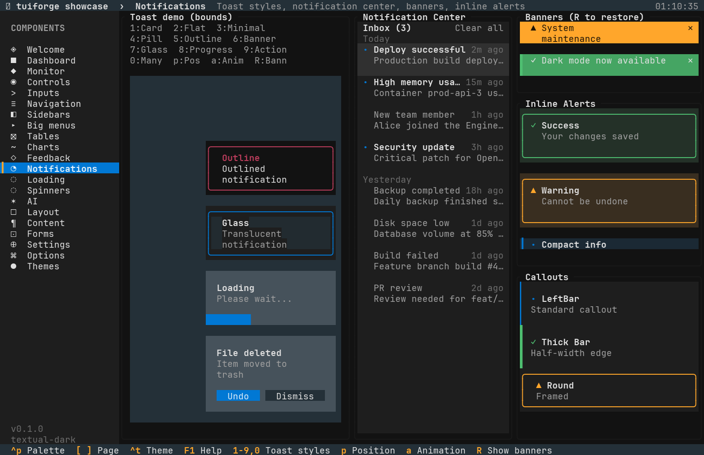
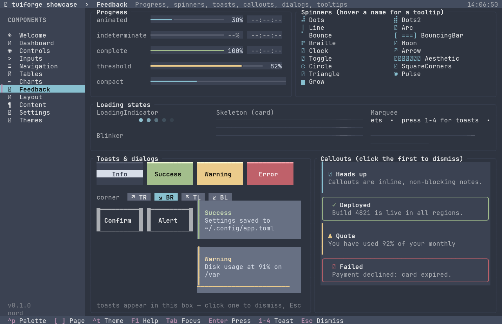

# Notifications

Toasts, notification centers, banners, and inline alerts for temporary and persistent messaging.



## Toast system

Toasts are temporary overlays that slide in, show a message, and auto-dismiss. The toast system has three pieces: `Toast` (one message), `Toaster` (state that owns the queue and handles timing), and `ToastStack` (the widget that renders them).

```rust
# extern crate tuile;
# extern crate ratatui;
use tuile::prelude::*;
use std::time::Instant;

# fn demo() {
let mut toaster = Toaster::new();
toaster.push(Toast::new("Saved", "File written successfully").variant(Variant::Success));
toaster.info("Quick message");

// In your app loop:
# let area = Rect::new(0, 0, 80, 24);
# let mut buf = Buffer::empty(area);
let now = Instant::now();
toaster.tick(now);
ToastStack::new().now(now).render(area, &mut buf, &mut toaster);
# }
# fn main() {}
```

### Lifecycle

A toast enters the queue when you call `toaster.push(toast)`. The `tick(now)` call checks expiry and removes closed toasts. `ToastStack` renders the visible subset (newest first), applies the animation, and tracks hover state for pause-on-hover. Call `tick` once per frame with the current time, and render the stack over your main UI.

### Creating toasts

`Toast::new(title, message)` takes two strings. The title is bold, the message is regular weight. Defaults: 5 second timeout, dismissible, no icon, Card style. Builder methods adjust these:

| Method | Effect |
|--------|--------|
| `variant(Variant)` | Changes color (Default, Primary, Success, Warning, Error, Accent). Default is `Variant::Default`. |
| `timeout(Duration)` | Auto-dismiss after this duration. Default is 5 seconds. |
| `no_timeout()` | Toast stays until manually dismissed. |
| `dismissible(bool)` | Whether clicking the toast dismisses it. Default is true. |
| `icon(impl Into<String>)` | Sets a custom icon glyph. If omitted, the variant picks a default (◔ for Default, ✓ for Success, ⚠ for Warning, ✗ for Error). |
| `style(ToastStyle)` | Override the global style for this toast. |
| `progress_value(f32)` | For Progress style, sets the fill percentage (0.0 to 1.0). |
| `actions(&[&str])` | Adds inline action buttons (see Action style below). |

The `Toaster` also has convenience methods that push pre-configured toasts:

```rust
# extern crate tuile;
# use tuile::prelude::*;
# fn demo(toaster: &mut Toaster) {
toaster.info("Connection established");
toaster.success("File saved");
toaster.warning("Low disk space");
toaster.error("Network timeout");
# }
# fn main() {}
```

Each creates a toast with the named variant, a capitalized title, and your message.

### ToastStyle

Ten styles, each with different visuals. The global style is set on the `Toaster` via `.style(ToastStyle::X)`, or per-toast with `toast.style(X)`.

| Style | Appearance |
|-------|------------|
| `Card` | Rounded rectangle with shadow, icon on the left, title and message stacked. Default. |
| `Flat` | Flat rectangle, no shadow, same layout as Card. |
| `Minimal` | Transparent background, single-line text, no border. |
| `Pill` | Highly rounded ends, compact single-line layout. |
| `Outline` | Transparent background with a variant-colored border. |
| `Banner` | Full-width bar (does not float in a corner), bold text. |
| `Glass` | Semi-transparent fill, blurred effect (where terminals support it). |
| `Progress` | Shows a horizontal progress bar under the message. Use `.progress_value(f)` to set fill. Does not auto-dismiss while progress is below 1.0. |
| `Action` | Includes inline action buttons. Use `.actions(&["Label", ...])` to add them. |
| `Grouped` | Stacks multiple toasts into a single card with a count badge when many arrive at once. |



### ToastPosition and ToastAnim

Toasts anchor to one corner or edge. Set the position on the `Toaster`:

```rust
# extern crate tuile;
# use tuile::widgets::{Toaster, ToastPosition};
# fn demo() -> Toaster {
Toaster::new().position(ToastPosition::TopRight)
# }
# fn main() {}
```

Six positions: `TopLeft`, `TopRight`, `BottomLeft`, `BottomRight`, `TopCenter`, `BottomCenter`. Default is `BottomRight`. Center positions place toasts in a vertical stack at the top or bottom center of the screen.

Four animations:

| Anim | Behavior |
|------|----------|
| `Slide` | Slides in from the edge. Default. |
| `Fade` | Fades in opacity. |
| `Pop` | Scales up from small to full size. |
| `None` | Appears instantly, no animation. |

Set the animation with `.anim(ToastAnim::Slide)`. Animations run on entry and on close. The close animation is always a fade, regardless of the entry animation.

### Timeouts and pause on hover

By default, toasts expire after their timeout (5 seconds) and start their close animation. Hovering over a toast does not pause the timer unless you enable it:

```rust
# extern crate tuile;
# use tuile::widgets::Toaster;
# fn demo() -> Toaster {
Toaster::new().pause_on_hover(true)
# }
# fn main() {}
```

With pause on hover, the toast will not expire while the mouse is over it. The timer resumes when the mouse leaves.

### Dismissing toasts

Click a dismissible toast to close it immediately, or call `toaster.dismiss(id, now)` from code. The toast plays its close animation and is removed after the fade completes (150ms by default). `toaster.dismiss_all(now)` starts the close animation for every toast.

The `id` comes from `toast.id()`, which returns a unique `u64` assigned when the toast is created. Store the id when you push a toast if you need to dismiss it later:

```rust
# extern crate tuile;
# extern crate ratatui;
# use tuile::prelude::*;
# use std::time::Instant;
# fn demo(toaster: &mut Toaster) {
let toast = Toast::new("Processing", "Please wait").no_timeout();
let id = toast.id();
toaster.push(toast);

// Later:
toaster.dismiss(id, Instant::now());
# }
# fn main() {}
```

### Action style and inline buttons

The `Action` style adds clickable buttons inside the toast. Use `.actions(&["Undo", "Dismiss"])` to provide the labels. The user navigates between buttons with Tab, Right, and Left, and activates the focused button with Enter or a click. When an action is activated, `handle_key` or `handle_mouse` returns `Outcome::Changed`.

To determine which action was activated, iterate `toaster.toasts` and check the `focused_action` field on toasts that have actions. The `toasts` vec is public, but `focused_action` is a private field, so you read it through the toast after the event. Typically you dismiss the toast after handling its action.

```rust
# extern crate tuile;
# extern crate ratatui;
use tuile::prelude::*;
use ratatui::crossterm::event::{Event, KeyEvent};
use std::time::Instant;

# fn handle_event(toaster: &mut Toaster, event: Event) {
let outcome = match event {
    Event::Key(k) => toaster.handle_key(k),
    Event::Mouse(m) => toaster.handle_mouse(m),
    _ => Outcome::Ignored,
};

if outcome == Outcome::Changed {
    // Check which toast's action was activated by inspecting toaster.toasts.
    // The actual focused_action field is private, so this is a simplified example.
    toaster.dismiss_all(Instant::now());
}
# }
# fn main() {}
```

Because `focused_action` is not exposed via a public accessor, you typically use the Action style when you know which toast has actions (for example, the most recently pushed undo toast) and dismiss it after any action.

### Grouped stacking

The `Grouped` style condenses multiple toasts into a single card. When more than one toast with the same variant exists, the stack shows the newest toast's message and a count badge. This prevents notification spam from filling the screen. Grouped toasts share the same timeout behavior as individual toasts.

### Builder options

The `Toaster` itself has configuration methods:

| Method | Effect |
|--------|--------|
| `style(ToastStyle)` | Default style for all toasts. Default is `Card`. |
| `position(ToastPosition)` | Where toasts anchor. Default is `BottomRight`. |
| `anim(ToastAnim)` | Entry animation. Default is `Slide`. |
| `max_visible(usize)` | Maximum toasts shown at once. Older toasts are hidden until newer ones close. Default is 3. |
| `bar(Edge)` | Border thickness for toasts. Default is `Edge::Thin`. |
| `pause_on_hover(bool)` | Whether hovering pauses the timeout. Default is false. |
| `reduce_motion(bool)` | Disables animations. Default is false. |

### When not to use toasts

Toasts are for transient messages that do not require action or acknowledgment. Use an `InlineAlert` or `Banner` for errors that block progress, `NotificationCenter` for messages the user should review later, or a modal dialog for decisions that require a response.

## NotificationCenter

A scrollable inbox for persistent notifications. Supports grouping by time or category, filtering by variant, marking as read, and dismissing individual items or the entire list.

### State and entries

`NotificationCenterState` owns the notification list. Each `Notification` has a title, message, variant, time label, read status, source, and group. Push notifications with `state.push(notification)`:

```rust
# extern crate tuile;
# use tuile::prelude::*;
# use tuile::widgets::notify::{Notification, NotificationCenterState};
# fn demo() {
let mut state = NotificationCenterState::new();
state.push(
    Notification::new("Deploy successful", "Production build deployed", "Today")
        .variant(Variant::Success)
        .time("2m ago")
);
state.push(
    Notification::new("High memory", "Container using 92% memory", "Today")
        .variant(Variant::Warning)
        .time("15m ago")
);
# }
# fn main() {}
```

The third argument to `Notification::new` is the group label (for example, "Today", "Yesterday", "Last week"). The notification center groups entries by this string and renders a divider between groups.

### Reading and dismissing

`state.unread_count()` returns the number of unread notifications. `state.mark_read(index)` marks one as read. `state.dismiss(index)` removes a notification. `state.dismiss_all()` clears the entire list. Indexes refer to positions in the `state.notifications` vec.

The notification center handles keyboard and mouse input:

| Input | Action |
|-------|--------|
| Up, Down | Navigate between notifications |
| Enter | Mark the selected notification as read |
| Delete | Dismiss the selected notification |
| Mouse click | Select and mark as read |

The top bar has a "Clear all" button that calls `dismiss_all()`.

### Filtering

`state.filter` is an `Option<Variant>`. When set, only notifications matching that variant are shown. Set it to `None` to show all. The center renders a filter bar with buttons for each variant. Clicking a filter toggles it on and off.

### Scrolling

The center scrolls to keep the selected item visible. Rendered height is determined by the area you pass to `render`. If the notification list exceeds the visible area, a scrollbar appears on the right.

## Banner

A full-width announcement bar for important messages. Banners typically sit at the top of the screen and remain visible until dismissed.

```rust
# extern crate tuile;
# extern crate ratatui;
use tuile::prelude::*;
use tuile::widgets::notify::{Banner, BannerState, BannerStyle};

# fn demo(area: Rect, buf: &mut Buffer) {
let mut state = BannerState::default();
Banner::new("Maintenance scheduled for tonight at 10 PM")
    .variant(Variant::Warning)
    .style(BannerStyle::Tinted)
    .action("Details")
    .render(area, buf, &mut state);
# }
# fn main() {}
```

### BannerStyle

Three styles:

| Style | Appearance |
|-------|------------|
| `Solid` | Solid variant background, white text. High contrast. |
| `Tinted` | Variant color tinted 15% into the background with a left accent rail. Subtle. |
| `Outline` | Transparent background with a variant-colored border. |

### Options

| Method | Effect |
|--------|--------|
| `variant(Variant)` | Color. Default is `Variant::Default`. |
| `style(BannerStyle)` | Visual style. Default is `Solid`. |
| `action(impl Into<String>)` | Adds a clickable action button on the right. |
| `closeable(bool)` | Whether the banner has a dismiss button. Default is true. |

The `BannerState` tracks visibility and action clicks. It starts hidden. Call `state.show()` to reveal the banner. When the user dismisses it, `state.visible()` returns false. When the action button is clicked, `handle_mouse` returns `Outcome::Changed` and `state.action_clicked()` returns true for one frame.

## InlineAlert

A stateless alert box for inline warnings, errors, or info messages. Two forms: framed (default) and compact.

```rust
# extern crate tuile;
# extern crate ratatui;
use tuile::prelude::*;
use tuile::widgets::notify::InlineAlert;

# fn demo(area: Rect, buf: &mut Buffer) {
InlineAlert::new("Invalid input", "Password must be at least 8 characters")
    .variant(Variant::Error)
    .render(area, buf);
# }
# fn main() {}
```

The framed style draws a rounded border with an icon on the left, title in bold, and message below. The compact style removes the border and draws a single line with icon, title, and message inline.

| Method | Effect |
|--------|--------|
| `variant(Variant)` | Color. Default is `Variant::Default`. |
| `dismissible(bool)` | Adds a close button (no state, purely visual). Default is false. |
| `compact(bool)` | Switches to compact single-line layout. Default is false. |

Because `InlineAlert` is stateless, dismissing it is the app's job. If you want interactive dismissal, wrap it in your own widget with state.

## count_badge

A helper function that draws a small circular badge with a count. Used by the notification center to show unread counts and by grouped toasts to show the stack size.

```rust
# extern crate tuile;
# extern crate ratatui;
use tuile::prelude::*;
use tuile::widgets::notify::count_badge;

# fn demo(buf: &mut Buffer, theme: &Theme) {
count_badge(buf, 10, 2, 5, theme);
# }
# fn main() {}
```

The signature is `count_badge(buf, x, y, count, theme)`. It draws a small circle at (x, y) with the count centered inside. Counts above 99 are rendered as "99+". The badge uses the theme's accent color.
